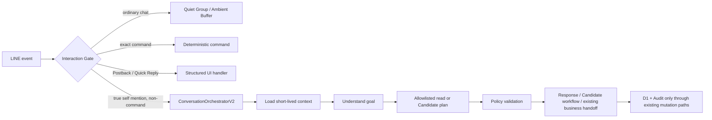

# Chicken Line Production — System Conformance Report

**Report date:** 2026-08-21 (Asia/Taipei)
**System:** `chicken-line-production`
**Scope:** Candidate Universal Repair + Cancel, Daily Operations Review, Bounded Conversational Agent V1, and read-only Ambient preview conformance audit
**Pre-repair user-supplied Production baseline:** `affc1d6a-6801-4914-b4fd-84b2e11a7002`
**Latest deployed Worker:** `b1d4dda8-0f56-438f-9d5d-578ea5a4fdff` (100% traffic)
**Local source under test:** additive Conversation Orchestrator V2 repair deployed to the latest Worker; no backend source HEAD SHA is claimed
**Source-lineage note:** the backend directory has no `.git` metadata; the deployed Worker version and Wrangler deployment records are therefore the authoritative deployment identity. No backend source HEAD SHA is claimed here.

## Executive result

The implementation separates three states that were previously easy to confuse:

```text
Ambient source:  buffered -> processed
Candidate:       open -> terminal
Official record: human confirmation -> existing business logic -> D1 + Audit
```

Candidate edits and cancellation do not re-open or re-digest the source messages. An open Candidate is now a durable group-level inbox item, independent of 24-hour Ambient source retention. Candidate edits preserve known fields and re-run deterministic resolution/reconciliation without re-running Ambient AI extraction.

A deterministic Daily Operations Review is already configured at **20:30 Asia/Taipei**, configured as **`30 12 * * *` UTC**, while preserving the hourly Ambient trigger **`0 * * * *`**. This turn adds a bounded conversational read/repair layer and the exact read-only `顯示待摘要訊息` preview. The review reads effective official records, keeps open Candidates in a separate section, is idempotent per organization/group/local date, and makes no data mutation when nobody responds.

Automated, local runtime, and Production read-only evidence are recorded below. Wrangler dry-run passed; the repaired source is deployed as Worker `b1d4dda8-0f56-438f-9d5d-578ea5a4fdff` with Health HTTP 200 and the existing Cron registrations. Actual mobile LINE rendering, notification behavior, and a real 20:30 production delivery remain human-review gates; local tests and remote read-only checks do not claim those as passed.

## Evidence sources and boundaries

| Evidence | What it proves | Boundary |
|---|---|---|
| `src/index.ts`, `src/ambient.ts`, `src/daily-review.ts`, `src/quick-correction.ts` | Current routing, workflow, resolver, reconciliation, correction, delivery code | Source behavior; not a substitute for mobile LINE review |
| `wrangler.jsonc` | Deployed configuration intent and bindings | Production registration is verified separately after deployment |
| `migrations/*.sql` | Schema history and additive change | Remote application is verified with Wrangler migration output |
| `npm run check` | TypeScript + Vitest | Does not prove remote trigger execution |
| `scripts/*-runtime-local.mjs` | Local D1/Worker end-to-end fixtures | Uses local fixtures; no Production official writes |
| `npx wrangler d1 ... --remote` | Production D1 read-only schema/counts | Read-only queries only |
| Wrangler deploy/deployment status and `/health` | Production version and health | Does not prove a user has opened LINE and observed the message |

Sensitive values such as LINE secrets, access tokens, passwords, full private chat text, and private user profile fields are intentionally excluded.

## Release artifacts

- Candidate Universal Repair parser: `src/candidate-workflow.ts` and `src/candidate-workflow.test.ts`.
- Candidate Inbox, postback routing, cancellation, partial updates, and reconciliation refresh: `src/index.ts` and `src/line-menu.ts`.
- Daily Review aggregation, Taiwan-local window, delivery idempotency, and review context: `src/daily-review.ts` and `src/quick-correction.ts`.
- Additive schema: `migrations/0024_candidate_repair_daily_review.sql`.
- Preserved/additive Cron configuration: `wrangler.jsonc`.
- Local runtime fixtures: `scripts/candidate-repair-runtime-local.mjs` and `scripts/daily-review-runtime-local.mjs`.

## Architecture

```mermaid
flowchart LR
  U[LINE user or group] --> L[LINE Messaging API]
  L --> W[Cloudflare Worker /webhook/line]
  W --> S[HMAC signature validation]
  S --> Q[Cloudflare Queue EVENTS]
  Q --> G[Interaction Gate]
  G --> R[Command / Postback / Quick Record routing]
  R --> P[Parser + Resolver + optional Workers AI proposal]
  P --> B[Existing business logic]
  B --> D[(Cloudflare D1)]
  B --> A[Immutable Audit]
  C[Cloudflare Cron] --> W2[scheduled(controller, env)]
  W2 --> J[executeScheduledJob]
  J --> H[Hourly Ambient Digest]
  J --> T[Daily Operations Review]
  J --> Y[Yunlin Weather]
  X[GitHub Pages Web UI] --> API[Worker /api/*]
  API --> AUTH[Web session + admin authorization]
  AUTH --> B
```

Primary source paths/functions:

- `src/index.ts`: Worker fetch/queue/scheduled entrypoints, LINE signature validation, Interaction Gate, command routing, reply/push sender, Candidate postbacks, scheduled dispatch.
- `src/core.ts`: command classification/parsing and operational command vocabulary.
- `src/line-menu.ts`: Flex menu, Message Action, Quick Reply, Postback builders, Candidate and Daily Review actions.
- `src/ambient.ts`: Ambient prefilter/extraction, prompt-constrained Workers AI, strict validation, deterministic salvage, Farm/House/Flock clue resolution, effective-record reconciliation, source consumption, per-group lease.
- `src/candidate-workflow.ts`: high-confidence natural-language Candidate repair intent parser.
- `src/daily-review.ts`: Taiwan-local review window, deterministic aggregation, pending-Candidate separation, delivery lease/idempotency, temporary review context.
- `src/quick-record.ts` / `src/quick-correction.ts`: existing operational/abnormal write, correction, reversal, move, split, and Audit paths.
- `src/web-api.ts`: authenticated Web management API and the same Production D1/business data model.
- `src/admin-auth.ts`: PBKDF2 admin password verification.

## LINE routing matrix

| Input | Immediate Bot? | Ambient buffer? | AI? | Official write? |
|---|---:|---:|---:|---:|
| Ordinary text `臭腳` outside state | No; quiet | Yes, text-only if group is authorized | No immediate AI | No |
| Ordinary text `死亡5` outside state | No; quiet | Yes | No immediate AI | No |
| `@Bot 臭腳` with `mentionees[].isSelf=true` | Yes | No | Only if semantic/ambient path needs it | Existing abnormal path may write after validation |
| `@Bot 摘要` | Yes | No; command is excluded | Ambient extraction only if pending source survives prefilter | Never directly; Candidate remains pending |
| Bare `摘要` outside explicit state | No; quiet | Ordinary text fallback only | No | No |
| Flex Menu / Message Action | Yes | No | Function-dependent | Existing function-dependent path |
| Postback | Yes | No | Function-dependent | Existing function-dependent path |
| Quick Reply Postback `臭腳`, Farm, quantity | Yes | No | No for deterministic choice | Existing Quick Record/business logic |
| Active 5-minute Quick Record session | Yes for same user/group | No | Existing parser/AI rules only where allowed | Existing Quick Record/business logic |
| Pending Farm/House/Flock response | Yes for scoped user/group | No | No unnecessary AI | Existing resolver/commit path |
| Open Candidate edit | Yes | No | Parser/AI interpretation only; no direct write | Candidate JSON/history only until final confirmation |
| Open Candidate cancel | Yes | No | Deterministic repair parser | Candidate terminal state; no official write |
| Daily Review correction | Yes after sent review context | No | Deterministic correction parser first; optional existing fallback | Existing Correction/Reversal/Move/Split + Audit |

The Gate is event-type-first. Postback is explicit. Message events require true self-mention, explicit system command, active scoped state, or pending state; otherwise they are quiet. `displayText` is client-rendered user interaction and is not reprocessed as a second ordinary text event.

## Wake conditions

The Worker wakes immediately for:

1. `message.mention.mentionees[].isSelf === true`.
2. Exact system commands and Message Actions already in the product menu.
3. Postback/Quick Reply events.
4. The same `line_group_id + line_user_id` active Quick Record session within the existing five-minute window.
5. Scoped Pending, Candidate Inbox, correction, and short-lived Daily Review correction state.

It does not treat domain words such as `死亡`, `臭腳`, `白冠`, `氣溫太高`, farm names, or caretaker names as global wake keywords. A Quick Reply carrying `displayText=臭腳` is active because the event is a Postback; a user manually typing `臭腳` outside a scoped state is quiet and is buffered for later Ambient processing.

Mention stripping is implemented before business parsing in `src/index.ts`; the Bot mention span is removed and the remaining content is sent to the existing parser/resolver. A mention-only event returns deterministic help/menu content and does not invoke Workers AI.

## Natural-language data entry

The existing fast path remains available:

```text
死亡32 咳嗽 臭腳
```

It reuses the operational/abnormal parser, resolver, Quick Record bundle, five-minute rolling session, Pending Bundle, and existing commit/Audit path. Farm-known text resolves directly; Farm-unknown text enters the existing Pending/Resolver path; caretaker-only clues are kept as clues and are not silently treated as farms. Multiple messages from one user in five minutes may form the same Quick Record session; different users remain isolated by `group_id + user_id`.

Ambient V2 uses the same vocabulary but does not write official data. It extracts source IDs/timestamps/users, event type, quantity and confidence, farm/caretaker/house/flock clues, uncertainty, and conflict evidence. It then resolves and reconciles against effective official records before presenting a Candidate.

## Entity model

```text
Organization
  ├─ Farms ── Farm aliases
  │    ├─ Houses ── Flocks/Batches
  │    └─ Caretaker assignments (effective date range)
  ├─ LINE groups / users
  ├─ Operational events ── Quick Record bundles/items
  ├─ Abnormal events
  ├─ Weather scope daily (Yunlin)
  ├─ Candidates ── Ambient source message IDs/fingerprint
  ├─ Audit logs
  └─ Investors / equity / distributions / allocations / expenses
```

Naming resolution is deterministic first. `FarmResolver` checks farm names and aliases; Ambient resolution separately checks farm text and caretaker assignments. Inputs such as `林志騰 二林場`, `二林場`, and `林志騰 二林場 A舍` preserve the different clues and resolve Farm, House, and Flock only when the current D1 data makes the result unique. Ambiguity becomes a Candidate question, not an exception.

## Quick Record state machine

```text
explicit Message Action / Postback / @Bot text
  -> Quick Record parser
  -> active session (group_id + user_id, rolling 5 minutes)
  -> Farm / House / Flock resolver
  -> Pending Bundle if unresolved
  -> validator
  -> existing operational/abnormal write
  -> quick_record_items + D1 + Audit
  -> correction / reversal / move / split when requested
```

The session boundary and five-minute duration are unchanged. New unrelated user text does not inherit another user’s session. Existing terminal/expiry states are preserved by the existing session/pending tables and cleanup paths.

## Candidate state machine

### Source lifecycle

```text
ordinary text -> ambient_chat_buffer.digest_status=buffered
  -> successful extraction + resolution + reconciliation
  -> Candidate durable OR NO_ACTIONABLE/ALREADY_RECORDED durable outcome
  -> ambient_chat_buffer.digest_status=processed
```

Technical failure (AI API, unrecoverable JSON, D1/transaction, lease infrastructure, unexpected exception) leaves source retryable. Source retention remains 24 hours; source cleanup does not decide Candidate completion.

### Candidate lifecycle

```text
open: pending / unresolved_entity / unresolved_quantity / conflict /
      possibly_recorded / due snoozed
  -> edit/field patch -> re-resolve -> re-reconcile -> still open or terminal
  -> human confirm -> confirmed + existing write/Audit
  -> strong deterministic match -> already_recorded (terminal)
  -> ignore -> ignored (terminal)
  -> cancel -> ignored + terminal_reason=cancelled (terminal)
  -> snooze -> snoozed_until; reappears when due without source re-extraction
```

Open Candidate rows are queried by organization and group without using the Ambient source `expires_at` as an exclusion. Terminal rows are not returned. A stale Postback is checked against the current open row and returns a safe “already processed” response instead of re-writing.

### Universal repair and cancel

`src/candidate-workflow.ts` parses high-confidence `show`, `set_field`, `clear_field`, `select_field`, `confirm`, `cancel`, `ignore`, and `snooze` intents. `src/index.ts` applies only structured Candidate patches, preserves known fields, records capped lightweight workflow history (`actorId`, timestamp, action, field, before/after, raw instruction), and re-runs deterministic resolution/reconciliation. It never inserts an official event directly.

Examples supported by the repair route include:

- `不是金雞測試場，是二林場`
- `改成東勢場`
- `數量不是5，是3`
- `舍別選錯`
- `這筆不對`

`這筆不對` returns a generic edit menu rather than an opaque parse error. If there are multiple open Candidates, an unqualified repair or cancel asks the user to select one. If there is exactly one, `取消`, `這筆不要`, `算了`, and `剛才那筆取消` target it. Candidate cancellation uses the existing terminal `ignored` status plus `terminal_reason=cancelled`; it does not hard-delete, re-buffer, or permanently suppress future independent events.

Minimum-question order is dynamic: quantity/conflict first when quantity is genuinely missing, then Farm, House, Flock, reconciliation, and final confirmation. A known quantity is not re-asked when Farm is the only blocking field.

## Daily Operations Review

### Schedule and routing

- Business time: **20:30 Asia/Taipei (UTC+8)**.
- Cloudflare expression: **`30 12 * * *`**.
- Existing hourly Ambient expression: **`0 * * * *`**, preserved.
- Yunlin Weather remains a sub-route of the existing hourly scheduled branch at its existing UTC hour; no Weather cadence/schema change was made.
- `src/index.ts:executeScheduledJob` calls `scheduledJobForCron` and runs exactly one explicit job branch. The daily expression cannot fall through to Ambient or Weather.

### Data window and content

`src/daily-review.ts:dailyReviewWindow` converts the current instant to Taiwan local date, then reads `[local day 00:00, local day 20:30]`. The aggregate is deterministic and does not call Workers AI. It reads:

- active, non-reversed `operational_events` by local `event_date`;
- Quick Record `occurred_at` when available, falling back to `operational_events.created_at` for legacy/direct rows;
- active abnormal events using `occurred_at`, `reported_at`, then `created_at`;
- Yunlin daily weather fields;
- open due Candidates in a separate “待確認資訊” section.

Corrections are represented by the existing reversal/new-effective-row semantics; reversed old records are excluded. Open or cancelled/ignored Candidates are never added to official totals.

### Delivery and no-response rule

`daily_operations_reviews` uses a deterministic organization/group/local-date key and a delivery lease. A sent review is not sent again for the same key; failed delivery is retryable without changing operational data. The message uses the global LINE sender, so `notificationDisabled=true`. The review context is short-lived until the next Taiwan local day and is only a correction affordance. No response means **NO CHANGE**.

When a member says `二林場死亡不是5，是3`, `src/quick-correction.ts:handleGroupCorrectionInput` resolves the group-level target and calls the existing correction/reversal/Audit primitives. Ambiguous targets ask for the smallest missing Farm/event selection instead of guessing.

### Cron table

| Expression (UTC) | Taiwan time | Job | Source function | AI? | LINE outbound? | D1 write? |
|---|---|---|---|---:|---:|---:|
| `0 * * * *` | every hour | Ambient Digest | `runProductionAmbientDigest` -> `runAmbientDigest` | at most existing Ambient extraction call when prefilter allows | Candidate only, push if actionable | source/candidate/lease state only |
| `0 * * * *` at the existing `scheduledAt.getUTCHours() === 18` branch | 02:00 Taiwan daily | Yunlin Daily Weather | `runWeatherDailyJob` | no | existing Weather behavior | Weather tables |
| `30 12 * * *` | 20:30 daily | Daily Operations Review | `runProductionDailyReview` -> `runDailyOperationsReview` | 0 for normal generation | one idempotent push per group/date | review delivery/context only |

The `wrangler.jsonc` trigger list is additive: `0 * * * *` and `30 12 * * *`.

## D1 and production inventory

### Migration history

The source migration directory contains `0001` through `0024`. The relevant Ambient/Candidate sequence is:

```text
0020_quiet_group_ambient_digest.sql
0021_ambient_candidate_source.sql
0022_ambient_review_state.sql
0023_ambient_digest_leases.sql
0024_candidate_repair_daily_review.sql  # this release; additive
```

`0024` adds Candidate terminal/workflow-history columns and the narrowly scoped `daily_operations_reviews` / `daily_review_contexts` tables. It does not modify old migrations, rebuild D1, or insert official operational data.

### Production read-only snapshot before migration

Evidence from remote D1 before applying `0024`:

| Item | Count/value |
|---|---:|
| Active organizations | 1 |
| Active farms | 9 |
| Production farms | 8 |
| Test farms | 1 |
| LINE groups | 1 |
| Ambient source rows | 3 |
| Ambient buffered rows | 0 |
| Ambient processed rows | 3 |
| Candidates | 1 |
| Open pending Candidates | 1 |
| Snoozed Candidates | 0 |
| Ignored Candidates | 0 |
| Digest lease rows | 1; lease state must be interpreted with ISO/datetime normalization |
| Daily Review tables | absent before `0024` |
| Finance allocated / expense / net | `434838.6 / 5500 / 429338.6` |

The existing real open Candidate and processed Ambient rows were not confirmed, ignored, cancelled, deleted, or otherwise consumed for testing. Production official synthetic writes: **0**.

### Table inventory

Current migrations cover LINE ingress (`line_groups`, `line_events`), organization/master data (`organizations`, `farms`, `farm_aliases`, `caretakers`, `farm_caretaker_assignments`, `houses`, `flocks`), official operations (`operational_events`, `abnormal_events`, `quick_record_sessions`, `quick_record_bundles`, `quick_record_items`), Ambient/Candidate (`ambient_chat_buffer`, `ambient_digest_candidates`, `ambient_digest_leases`), review state (`daily_operations_reviews`, `daily_review_contexts`), weather (`weather_scopes`, `weather_scope_daily`, legacy weather/AI report tables), finance (`investors`, `farm_investor_equity`, `profit_distributions`, `profit_distribution_allocations`, expenses), authentication/admin/session tables, semantic locks, and `audit_logs`.

## Official write entry points and data safety

Official records are written through existing paths, not the Ambient Candidate renderer:

- LINE Quick Record / operational parser in `src/quick-record.ts` and `src/index.ts`.
- LINE abnormal path in `src/line-abnormal.ts` and existing classification/validator flow.
- Candidate final confirmation calls the existing Quick Record/business logic path (`applyAmbientCandidateItems`), not a Candidate-specific operational INSERT.
- Existing Correction/Reversal/Move/Split primitives in `src/quick-correction.ts` create effective replacement/reversal records and Audit entries.
- Web `/api/operational-events` creation and `/reverse`/`/correct` routes in `src/web-api.ts` use authenticated session/business validation and Audit paths.

Candidate edits are workflow history, not official Audit entries. Official correction/reversal/move/split remains Audit-producing. Ambient and Daily Review generation never modifies Finance, official operational records, or official Audit records.

The current schema uses reversal markers and replacement links rather than hard-deleting official records. The report treats any direct SQL `UPDATE` used to mark a reversal as part of the existing correction transaction; a direct un-audited arbitrary UPDATE/DELETE route would be a GAP and is not used by the new Candidate/Daily Review code.

## Reconciliation and AI permission audit

Ambient reconciliation loads effective operational and abnormal records in one relevant time window, preferring Quick Record `occurred_at` and excluding reversed/inactive rows. Deterministic scoring uses event type, quantity, Farm, House/Flock, group, source actor, raw meaning, and time. It produces `already_recorded`, `possibly_recorded`, or `not_recorded`; ambiguous or possible matches remain user-facing work.

Current Ambient matching margin is ±15 minutes for ordinary records, with a six-hour continuation window for wording such as `還在咳`/`咳嗽沒改善`. Same quantity alone, same farm alone, or same hour alone is not enough for high-confidence suppression. A reversed old record is not an effective match.

Workers AI model remains `@cf/meta/llama-3.2-3b-instruct`. Ambient extraction uses a prompt-constrained JSON response and strict local schema validation, with safe fenced-JSON parsing and deterministic salvage. The model is a proposal/interpretation tool only. It cannot call D1, LINE senders, Finance writes, Candidate terminal transitions, or official correction functions. Deterministic Daily Review generation uses zero AI calls. Existing read-only AI analysis exposes allowlisted read tools such as operational events, flocks, summaries, finance/weather reads; no write tool is exposed.

One unrelated semantic-intent path in `src/index.ts` still uses its existing Workers AI structured-output request shape; this was not changed in the Daily Review release. Ambient V2 itself does not use the incompatible Ambient `response_format: json_schema` shape.

## Web and D1 source of truth

LINE and Web use the same Worker binding `DB` pointing to the Production D1 database `chicken-line-production` (database id configured in `wrangler.jsonc`). Web requests enter `src/web-api.ts:handleWebApi`, require the Web session/auth boundary, and call the same domain tables and Audit model. No secondary canonical Web database or direct frontend-to-D1 path exists in the inspected source. GitHub Pages is a client; it does not receive the LINE secret, D1 credentials, or admin password.

Structural master-data operations (Farm, House, Flock, Caretaker and assignments) require an active Web admin session and continue through the existing validation, business-logic and Audit paths. The password is required at Web login; the removed per-operation fresh-authorization route is no longer used. Secret values are not included in this report.

## LINE outbound audit

All Bot Messaging API sends converge on the two shared functions in `src/index.ts`:

- `replyLine` -> `/v2/bot/message/reply`.
- `pushLine` -> `/v2/bot/message/push`.
- `buildLineReplyPayload` and `buildLinePushPayload` enforce request-level `notificationDisabled: true`.

Flex, Quick Reply, Candidate actions, AI answers, Pending prompts, Weather, Ambient Digest, Daily Review, errors, and confirmations use these senders. Message Action and Postback `displayText` are user/client interactions, not Bot outbound payloads, and remain unchanged. Source audit found no second direct `api.line.me` sender in Production code. Direct sender bypass: **0**.

## Queue, idempotency, and retention

### Queue

`wrangler.jsonc` binds producer `EVENTS` to `chicken-line-events`; consumer batch size is 10, `max_batch_timeout=0`, and max retries is 3. The webhook validates the LINE signature and enqueues events. The consumer runs `processEvent`, acknowledges success, and retries failures. Scheduled jobs bypass the event Queue and call the shared scheduled functions directly.

### Idempotency

| Area | Mechanism | Scope |
|---|---|---|
| LINE webhook | `webhookEventId`/deterministic event key in `line_events` | Event |
| Queue | Ack on success, retry on exception | Queue message |
| Semantic actions | Existing `line_semantic_action_locks` | Group + user + action, existing TTL |
| Ambient source | Unique `line_message_id` and `digest_status` | Source message |
| Ambient digest | `ambient_digest_leases` | Organization + group, recoverable short lease |
| Candidate Postback | Candidate ID + scoped status check | Candidate/action |
| Candidate official write | Existing Quick Record/semantic/action protections | Bundle/item |
| Daily Review | Deterministic organization + group + review type + Taiwan local date | One review delivery per group/date |
| Correction | Existing request/item/bundle and reversal links | Official item/bundle |

### Retention

- Ambient source: 24 hours, ephemeral; processed rows may remain until cleanup but are excluded from pending selection.
- Open Candidate: not coupled to Ambient source expiry; remains until confirmed, already-recorded, ignored, cancelled, or an explicit future policy action. Snooze uses `snoozed_until` and does not re-run extraction.
- Terminal Candidate: existing expiry/cleanup policy may apply after terminal state; not part of open inbox.
- Official operational/abnormal records and Audit: existing durable policy; no hard delete introduced here.
- LINE event history: existing cleanup removes rows older than 90 days in the scheduled path.
- Diagnostics: structured Worker logs/Cloudflare observability; no full private conversation dump is added.

## Observability and failure matrix

Ambient diagnostics include trigger, group-safe identifier, run id/owner, cutoff, source count, lease result, prefilter/AI/validation stage, candidate/reconciliation counts, consume result, delivery result, final status, error stage, and error class. Daily Review logs `daily_operations_review_complete` or `daily_operations_review_cron_error`, including group/sent/already-sent/busy/failed counts. LINE, AI, D1, lease, and delivery failures remain observable as structured errors without tokens or full private chat text.

| Failure or state | User result | Retry? | Data loss? | Duplicate risk |
|---|---|---:|---:|---:|
| Ambient AI failure | Source remains retryable; no technical false success | Yes | No | Lease/idempotency guarded |
| Invalid Ambient JSON with no salvage | Source remains retryable | Yes | No | Candidate not created |
| Farm/House/Quantity unknown | Candidate asks the minimum question | No AI re-extraction | No | Source processed; Candidate open |
| Candidate conflict/possible duplicate | Candidate remains visible for human decision | No source re-extraction | No | Terminal action/status guarded |
| Candidate cancel | Candidate becomes `ignored` + `terminal_reason=cancelled` | No | No | Source remains processed |
| Candidate field patch | Candidate JSON/history updated; known fields retained | No AI re-extraction | No | Reconciliation rerun |
| D1 Candidate update failure | Technical failure; source/Candidate transaction is not treated as complete | Yes | No intended | Retryable |
| LINE Reply failure | Webhook/consumer error path remains observable | Existing retry behavior | No intended | Event/idempotency guarded |
| LINE Push failure for Ambient | Candidate/source state remains durable; delivery error is logged | Existing safe retry path | No | No AI re-extraction |
| Daily Review push failure | Review row is failed/retryable; official data unchanged | Yes | No | Deterministic review key |
| Queue retry | Event is retried; successful event is acknowledged | Yes | No | `line_events`/event key |
| Daily Review no response | No mutation | No | No | No second automatic correction |
| Ambiguous Daily Review correction | Minimal clarification | Yes after clarification | No | No guessed target |

## Security boundaries

- LINE webhook: HMAC-SHA256 signature verification before JSON/event enqueue.
- Queue: only validated webhook events or internal classification messages are processed.
- Quiet mode: ordinary text cannot immediately write official data.
- Mention wake: uses LINE mention metadata `isSelf`, not a text substring.
- Web: session authentication, organization scoping, CORS checks, PBKDF2 password verifier at login, and Audit-backed structural changes without repeated password prompts.
- Secrets: LINE secret/token and admin password hash are Worker bindings/secrets; not frontend values and not logged.
- AI: no D1/Finance/official-write tool permission; proposal/analysis only.
- Runtime test endpoints: token-gated and intended for local/controlled verification; they are not part of the public product path.
- D1: shared Worker binding; all new code scopes organization and group IDs on Candidate/review actions.

## Invariants

| Product invariant | Status | Code/test/Production evidence |
|---|---|---|
| Ordinary chat does not interrupt the group | PASS | `interactionGateDecision`, quiet-buffer path in `src/index.ts`; Ambient runtime 24/24 |
| `@Bot` explicitly wakes | PASS | `hasSelfMention` + mention stripping; existing mention runtime coverage |
| Quick Reply/Postback work immediately | PASS | Postback router and Menu runtime 48/48 |
| AI does not directly write official data | PASS | `ambient.ts`/`analysis.ts` read/proposal paths; no AI write tool; Digest V2 16/16 |
| Human confirmation is required for Ambient official write | PASS | Candidate confirmation calls existing Quick Record path; Candidate runtime 12/12 |
| Source processed is not Candidate complete | PASS | Separate `ambient_chat_buffer` and Candidate inbox; Candidate runtime 12/12 |
| Open Candidate does not silently disappear | PASS | Inbox excludes source expiry; migration adds workflow history; local cleanup/persistence runtime |
| Candidate cancel does not re-digest source | PASS | cancel uses terminal `ignored` + processed source; candidate runtime |
| Official corrections preserve Audit | PASS | existing Correction/Reversal/Move/Split and Web runtime 31/31 |
| LINE and Web share D1 | PASS | same `DB` binding/config and `src/web-api.ts`; remote database evidence |
| Daily Review no response means no change | PASS | deterministic review sender has no mutation path; Daily Review runtime 9/9 |
| Daily Review correction uses formal correction/Audit | PASS | `handleGroupCorrectionInput` -> existing correction primitives; local runtime and source audit |
| All Bot outbound is silent | PASS | centralized payload builders and outbound unit tests |
| Weather is Yunlin daily summary | PASS | `runWeatherDailyJob`, `weather_scope_daily`, Open-Meteo configuration |
| Finance is not changed by Ambient/AI | PASS | separate finance routes/tables; remote checksum unchanged |

## OPEN_GAPS

| Severity | Gap | Evidence | Recommended minimal follow-up |
|---|---|---|---|
| MEDIUM | `operational_events` does not expose one canonical occurred-at column for every write path. Daily Review prefers `quick_record_items.occurred_at`, then falls back to `operational_events.created_at` for legacy/direct rows. | `src/daily-review.ts:buildDailyReviewSnapshot`; schema inspection | Future additive migration to canonicalize occurred time, followed by backfill/review. Not added in this release to avoid changing official event schema. |
| LOW | Backend source directory has no Git metadata, so a backend source HEAD cannot be independently proven from this checkout. | `git -C outputs/chicken-line-production status` reports not a repository; Wrangler deployment identity is available | Restore/attach backend repository metadata or publish a source artifact manifest. |
| PENDING_REAL_LINE | Human must verify actual LINE screen appearance, notification-disabled behavior, Candidate repair/cancel, and a real 20:30 delivery. | Local/runtime tests cannot prove device notification state or a user's tap | Perform the minimal LINE review in the deployment report. |
| LOW | Production `line_groups` row was observed with `status=unbound` while organization mapping exists. | Remote read-only snapshot before migration | Confirm whether this is intentional product state or repair the group binding in a separately approved data task; no state changed here. |

No CRITICAL/HIGH issue was found in the implemented scope after local verification. No unrelated Finance, Weather schema/semantics, Queue timeout, Hourly cadence, LINE secret, webhook URL, Billing, or AI model change was made.

## Reviewer evidence index

1. `SYSTEM_CONFORMANCE_REPORT.md` — this report.
2. Architecture diagram — this report, Architecture section.
3. LINE routing matrix — this report, LINE routing matrix section.
4. Candidate state machine — this report, Candidate state machine section.
5. Quick Record state machine — this report, Quick Record state machine section.
6. Scheduled jobs table — this report, Daily Operations Review section.
7. D1 migration/table inventory — this report, D1 section and `migrations/*.sql`.
8. Entity relationship summary — this report, Entity model section.
9. Official write entry points — this report, Official write entry points section.
10. AI call sites/permissions — this report, Reconciliation and AI permission audit.
11. LINE sender audit — this report, LINE outbound audit.
12. Web write path — this report, Web and D1 source of truth.
13. Correction/Audit path — `src/quick-correction.ts`, `src/web-api.ts`, Audit section.
14. Retention — this report, Retention subsection.
15. Idempotency — this report, Idempotency table.
16. Production inventory — this report, remote read-only snapshot.
17. Automated gates — below and final deployment message.
18. Runtime results — below and package scripts.
19. OPEN_GAPS — above.

## Automated gates and runtime evidence

The final deployment message records the exact post-change command output. The current verified local gates are:

| Gate | Result |
|---|---|
| `AUTOMATED-CANDIDATE-UNIVERSAL-REPAIR` | PASS — Candidate repair runtime 15/15 |
| `AUTOMATED-CANDIDATE-NATURAL-LANGUAGE-PATCH` | PASS — Candidate repair runtime |
| `AUTOMATED-CANDIDATE-UNKNOWN-FALLBACK` | PASS — Candidate repair runtime |
| `AUTOMATED-CANDIDATE-CANCEL-QUICK-REPLY` | PASS — Candidate repair runtime |
| `AUTOMATED-CANDIDATE-CANCEL-COMMAND` | PASS — Candidate repair runtime |
| `AUTOMATED-CANDIDATE-CANCEL-MULTIPLE-SELECTION` | PASS — Candidate repair runtime |
| `AUTOMATED-CANCEL-SOURCE-NO-REDIGEST` | PASS — Candidate repair runtime |
| `AUTOMATED-CANCEL-DOES-NOT-PERMANENTLY-SUPPRESS-NEW-EVENT` | PASS — Candidate repair runtime |
| `AUTOMATED-CANDIDATE-EDIT-PRESERVES-KNOWN-FIELDS` | PASS — Candidate repair runtime |
| `AUTOMATED-RECONCILE-AFTER-CANDIDATE-EDIT` | PASS — Candidate repair runtime |
| `AUTOMATED-DAILY-REVIEW-CRON` | PASS — daily-review test + scheduled runtime |
| `AUTOMATED-DAILY-REVIEW-TAIPEI-TIME` | PASS — timezone unit tests |
| `AUTOMATED-DAILY-REVIEW-EFFECTIVE-RECORDS` | PASS — Daily Review runtime 9/9 |
| `AUTOMATED-DAILY-REVIEW-CORRECTION-EFFECT` | PASS — local effective-record fixture |
| `AUTOMATED-DAILY-REVIEW-REVERSAL-EFFECT` | PASS — local effective-record fixture |
| `AUTOMATED-DAILY-REVIEW-PENDING-SEPARATION` | PASS — Daily Review runtime |
| `AUTOMATED-DAILY-REVIEW-NO-RESPONSE-NO-CHANGE` | PASS — Daily Review runtime |
| `AUTOMATED-DAILY-REVIEW-CORRECTION` | PASS — group correction path |
| `AUTOMATED-DAILY-REVIEW-IDEMPOTENCY` | PASS — one send per group/date |
| `AUTOMATED-DAILY-REVIEW-SILENT` | PASS — shared push sender payload test |
| `AUTOMATED-PRESERVE-EXISTING-CRONS` | PASS — `0 * * * *` retained and `30 12 * * *` added |
| `AUTOMATED-SCHEDULED-ROUTING` | PASS — explicit dispatcher, scheduled runtime 5/5 |
| `AUTOMATED-SYSTEM-CONFORMANCE-REPORT` | PASS — this evidence artifact exists and is source-backed; current-turn addendum below supersedes historical counts |

Existing regression commands:

| Suite | Latest local result |
|---|---:|
| TypeScript + Vitest | 195/195 PASS |
| Menu runtime | 48/48 PASS |
| Quick Record runtime | 25/25 PASS |
| Quiet/Ambient runtime | 24/24 PASS |
| Manual Ambient Digest runtime | 28/28 PASS |
| Scheduled Digest runtime | 5/5 PASS |
| Digest V2 runtime | 16/16 PASS |
| Candidate Repair runtime | 15/15 PASS |
| Daily Review runtime | 9/9 PASS |
| Web runtime | 31/31 PASS — previously authorized remote baseline; no Web source changed this turn; current replay remains external-prerequisite-gated |
| Wrangler dry-run | PASS |

The current local replay of the legacy Web harness was not counted as a new PASS: it requires Workers AI, which is unavailable in local Miniflare, and its old natural-language fixtures predate Quiet Group Mode. No Web source path was changed in this release. The authoritative current automated source/test result remains the prior authorized 31/31 baseline; a new remote replay is intentionally `PENDING_EXTERNAL_PREREQUISITE` without the Production runtime token.

## Direct answers to reviewer questions

**Q1. Ordinary chat immediate wake?** No. It is quiet and, for authorized groups, text-only buffered.

**Q2. Is `@Bot` real mention metadata?** Yes. The primary check is LINE `mentionees[].isSelf === true`; text substring is not the primary wake signal.

**Q3. Do Quick Reply/Postback work immediately?** Yes. They are explicit events routed before ordinary-text handling.

**Q4. When does ordinary content enter Ambient?** At the quiet branch of `processEvent`, after group authorization/context lookup, with message ID uniqueness and text-only storage.

**Q5. When is source processed?** After extraction, resolution, reconciliation, and durable Candidate/no-action/already-recorded outcome; technical failure leaves it retryable.

**Q6. When is Candidate open?** For pending, unresolved entity/quantity, conflict, possible duplicate, and due snoozed work until a terminal human/system outcome.

**Q7. Can an open Candidate silently disappear?** It must not. Inbox query is independent of Ambient source expiry; the 0024 workflow fields retain lifecycle evidence.

**Q8. How is Candidate modified?** Postback field menu or natural-language repair intent -> structured patch -> Resolver/Validator -> Candidate JSON/history -> reconciliation.

**Q9. How is Candidate cancelled?** Explicit Candidate Postback `ambient_candidate_cancel` or scoped natural language such as `取消`; multiple open items require selection.

**Q10. Why no re-digest after cancel?** Source remains `processed`; cancellation only terminates the Candidate and never re-buffers source.

**Q11. Can AI write D1?** No. Ambient AI produces validated proposal JSON only; official writes use existing business logic after human confirmation.

**Q12. Can AI modify Finance?** No. Finance is read/write-protected by existing Web/business routes and is not an AI tool.

**Q13. Official write entry points?** LINE Quick Record/abnormal handlers, confirmed Ambient Candidate through Quick Record logic, and authenticated Web operational-event routes.

**Q14. Do corrections leave Audit?** Existing correction/reversal/move/split paths write Audit and effective replacement/reversal links.

**Q15. Do LINE and Web share D1?** Yes. Both use the Worker `DB` binding for `chicken-line-production`.

**Q16. Does Web bypass business logic?** Inspected Web routes enter `handleWebApi`, session/auth checks, validation, D1 and Audit paths; no frontend direct-D1 path was found.

**Q17. Current Cron jobs?** Hourly Ambient `0 * * * *`, existing Yunlin Weather sub-route at its existing hourly UTC branch, and Daily Review `30 12 * * *`.

**Q18. Is Daily Review 20:30 Taiwan?** Yes: `30 12 * * *` UTC, with explicit `Asia/Taipei` local-date conversion.

**Q19. What does no Daily Review response do?** Nothing. Official records and Audit remain unchanged.

**Q20. What path handles Daily Review correction?** Short-lived review context -> group-scoped target resolution -> existing Correction/Reversal/Move/Split + Audit.

**Q21. Are open Candidates in official Daily Review totals?** No. They appear only in a separate pending section.

**Q22. Are all Bot outbound messages silent?** Payload builders enforce `notificationDisabled: true` for Reply and Push; real device behavior remains a human LINE review gate.

**Q23. What does Weather persist?** Yunlin daily scope rows with condition, maximum/minimum temperature and timestamps; no new hourly permanent weather rows were added.

**Q24. Finance source of truth?** Production D1 finance tables and existing authenticated Finance routes; current checksum is allocated `434838.6`, expense `5500`, net `429338.6`.

**Q25. Known gaps?** Canonical occurred-at coverage for all legacy/direct operational rows, missing backend Git metadata, pending real LINE/device verification, and the observed `line_groups.status=unbound` configuration state. See OPEN_GAPS.

## Current-turn conformance addendum — bounded conversational agent and pending Ambient preview

This addendum is the authoritative evidence for the current turn. It supersedes any earlier deployment wording in this report. The source changes below were tested locally and dry-run packaged, but were **not deployed** because Wrangler authentication is expired. The Production Worker therefore remains the user-supplied `affc1d6a-6801-4914-b4fd-84b2e11a7002`.

### Root cause of the prior “not smart” behavior

The prior path treated an unrecognized mentioned message as a command/repair parse. `handleAmbientUniversalCandidateInput` and the semantic fallback were reached without a context-aware read/explain branch; when the text did not match a fixed repair shape, the safe rejection response was returned. There was no route that loaded the current Candidate evidence, resolution conflicts, and caretaker/farm relations to answer a question such as `飼養者線索有什麼不同`.

The additive route is now in `src/index.ts` as `handleConversationalAgentInput`. It runs after scoped Quick Record/Pending handlers and before the old universal repair/semantic fallback. It loads the group Candidate Inbox, selects the only Candidate when safe, asks for a Candidate choice when there are multiple, and sends EXPLAIN/QUERY work to read-only helpers. It returns `null` for domain-record text and active scoped flows so the existing Quick Record and Pending semantics are not stolen.

### Bounded goal router

| Goal | Current deterministic examples | Safe result |
|---|---|---|
| `EXPLAIN` | caretaker clue difference, why blocked, what is wrong | `explainAmbientCandidate`, read-only Candidate evidence |
| `QUERY` | caretaker’s farms, farm’s caretakers, current pending count | allowlisted D1 read helper |
| `SHOW_STATE` | what the Bot currently knows, current Candidate status | Candidate state explanation |
| `REPAIR` | use this Farm, change the Farm, do not care about caretaker | existing structured Candidate patch/dismissal path |
| `RECORD` | ordinary operational text such as `死亡5 咳嗽` | existing Quick Record/semantic path; no agent direct write |
| `CANCEL` | cancel this Candidate | scoped existing Candidate cancel path |
| `NAVIGATE` | menu/postback navigation | existing command/Postback router |
| `CLARIFY` | “這筆有點不對” with one Candidate; Candidate selection with many | one minimum-question edit menu or Candidate selection |
| `HELP` | help-like text | existing help/menu response |

`src/conversational-agent.ts` performs deterministic routing first. The bounded Workers AI fallback is only a goal classifier, uses prompt-constrained JSON plus `extractJsonValue`, and is accepted only after the local goal/field/value schema check. It has no official mutation tool.

### Current context and candidate scope

- Candidate Inbox context is loaded by `organization_id + line_group_id` at the event cutoff. Candidates are group-level work items; the acting `line_user_id` is recorded by the existing workflow history/terminal action.
- One open Candidate is a safe implicit current Candidate. Multiple open Candidates never cause a guess; the user receives Candidate choices.
- A user’s active Quick Record session and Pending state remain scoped to `line_group_id + line_user_id` and bypass the conversational layer.
- Daily Review correction context remains the existing short-lived group review context; it is not silently converted into an Ambient Candidate context.
- No new context migration was required. Existing Candidate JSON, workflow history, Pending, session, and Daily Review context tables are sufficient for this additive layer.

### Authority and evidence priority

```text
explicit user decision
  > verified Resolver / D1 business data
  > deterministic inference
  > Ambient / AI clue
```

Farm selection and caretaker-clue dismissal now persist in `candidate_json.userOverrides`. A legal Farm selected by the user is authoritative over an inferred caretaker clue. The clue and its provenance remain available for explanation, and dismissal is represented as a Candidate workflow edit. Database organization scope, authorization, Farm/House/Flock ownership, and other hard business invariants still run through the existing Resolver/Validator and cannot be overridden by AI or plain text.

### Caretaker clue rule and user override

`AmbientCandidate.caretakerText` is an optional evidence clue, not an operational-event foreign-key requirement. The current official operational/abnormal write schemas and validators require the resolved organization/Farm and any applicable House/Flock constraints; they do not require a caretaker assignment for a mortality event. The assignment table is used for resolution evidence.

Therefore:

- `林志騰` can explain why the extractor proposed a clue.
- A valid explicit Farm selection such as `金雞測試場` is retained even when that Farm has no active `林志騰` assignment.
- The previous clue conflict is removed from the blocking set, while the original clue and override provenance remain.
- `那不要管林志騰` becomes a structured `dismiss_clue` Candidate patch.
- An unknown or unauthorized Farm remains blocked by normal Resolver/Validator checks.

### Bounded tool inventory and write boundary

The allowlist is declared as `CONVERSATIONAL_TOOL_ALLOWLIST` in `src/conversational-agent.ts` and executed only by typed Worker helpers:

**Read tools:** `loadAmbientCandidateInbox`, `explainAmbientCandidate`, `queryCaretakerFarms`, `queryFarmCaretakers`, `previewBufferedAmbientMessages`.

**Candidate-draft tools:** `applyAmbientCandidatePatch`, `applyAmbientCandidateEntityChoice`, `dismissAmbientCandidateClue`, `cancelAmbientCandidate`, `setAmbientCandidateReview`.

**Official tools exposed to the agent:** none. The list is intentionally empty. The agent has no arbitrary SQL, arbitrary fetch, raw D1 mutation, `update_official_record`, `delete_event`, Finance mutation, or Farm master-data mutation capability. Candidate patches still pass deterministic entity resolution, validation, workflow history, and reconciliation. Official writes continue through Quick Record, abnormal-event, confirmed Candidate, Correction, Reversal, Move, Split, and existing Web business paths.

| Goal | Read allowed | Candidate mutation | Official mutation | Confirmation |
|---|---:|---:|---:|---:|
| EXPLAIN / SHOW_STATE | Yes | No | No | No |
| QUERY | Yes | No | No | No |
| Candidate REPAIR | Yes | Validated patch only | No | Final record confirmation when required |
| Candidate CANCEL | Yes | Scoped terminal Candidate action | No | Scope selection if multiple |
| Official correction/record | Yes | Proposal/context only | Existing business logic only | Existing product confirmation |

### AI call-site compatibility audit

The source inventory found five Workers AI call sites. All use the pinned model `@cf/meta/llama-3.2-3b-instruct`, prompt-constrained JSON where structured output is needed, safe extraction, and strict local validation. No executable request contains `response_format:`, `json_schema`, or `json_object` response-format options.

| File / function | Purpose | Parser / validation | Direct official write? |
|---|---|---|---:|
| `src/ambient.ts` / Ambient extraction | Extract facts and uncertainty from buffered chat | fenced/substring JSON extraction, Ambient schema validation, deterministic salvage | No |
| `src/index.ts` / `parseSemanticWithAiModel` | Existing semantic intent fallback | `parseAiUnifiedIntent` local validation | No; caller gates business writes |
| `src/analysis.ts` / `runReadOnlyAnalysis` | Read-only analysis | structured analysis parser | No |
| `src/analysis.ts` / abnormal classification | Read-only abnormal classification metadata | local classification validator | No; existing event flow owns writes |
| `src/conversational-agent.ts` / `classifyConversationalGoalWithAi` | Bounded goal classification fallback | `parseConversationalAiForTest`/local schema check | No |

`src/ai-json.ts` centralizes safe response text and fenced/embedded JSON extraction. `src/ai-callsite.test.ts` scans the production source for executable unsupported response-format fields and asserts the pinned model/call contract. The current model was not changed and no benchmark was run.

### Exact diagnostic command: `顯示待摘要訊息`

**Trigger:** normalized exact bare text `顯示待摘要訊息`, or a true LINE self-mention whose mention-stripped content is exactly that text. Broad substring matching is not used. The command is classified as `pending_ambient_preview` in `src/core.ts` and handled before the ordinary Ambient path in `src/index.ts`.

**Data source and selection:** `previewBufferedAmbientMessages` reads `ambient_chat_buffer` directly with the authorized organization/group scope, `digest_status = 'buffered'`, `expires_at > cutoff`, and `event_timestamp <= cutoff`, ordered by event time and ID. It includes old failed buffered rows, not only the current clock hour. It reads open Candidate and recent processed counts for context, and reuses the deterministic `ambientPrefilter` only in memory for classification.

**Side-effect contract:** zero Workers AI calls; zero Candidate creation; zero Candidate mutation; zero source consumption; zero digest lease; zero official D1 mutation; zero `line_events` insert. The command is intentionally handled as a pure read before the normal event-idempotency write so repeated diagnostic previews remain state-neutral; the command itself is never inserted into Ambient.

**Output:** two sections are rendered: `可能營運資訊` and `已捕捉但目前未判定為營運資訊`. Timestamps are rendered in `Asia/Taipei`; raw group-visible text is shown, while internal UUIDs, user IDs, tokens, and secrets are not. Page size is 10, maximum 20, with explicit previous/next Postbacks. A separate explicit `摘要` action is the only path from the preview to the existing digest pipeline.

Example from the local D1 runtime fixture:

```text
🧪 待摘要訊息檢查
截止：2035/01/01 08:01（Asia/Taipei）
待摘要來源：2 筆｜第 1/1 頁
【可能營運資訊】
2035/01/01 08:00｜死亡5
判定：可能營運
【已捕捉但目前未判定為營運資訊】
2035/01/01 08:00｜林志騰
判定：prefilter excluded
buffered：2
candidate-like：1
prefilter-excluded：1
Open Candidate：0
最近24h已處理來源：0
本檢查只讀取，不摘要、不建立候選、不消費來源。
```

| Command | Reads | AI | Candidate | Source | Digest lease |
|---|---|---:|---:|---:|---:|
| `顯示待摘要訊息` | Buffered source + prefilter preview + counts | 0 | 0 | unchanged | 0 |
| `摘要` / `@Bot 摘要` | New buffered source, then Candidate Inbox | Existing Ambient extraction only when needed | May create durable Candidate | Successful source consumed | Existing shared lease |

### Current-turn gates and runtime evidence

| Gate / runtime | Result |
|---|---|
| `AUTOMATED-AI-CALLSITE-INVENTORY` | PASS |
| `AUTOMATED-NO-UNSUPPORTED-JSON-SCHEMA` | PASS |
| `AUTOMATED-CONVERSATIONAL-GOAL-ROUTING` | PASS |
| `AUTOMATED-EXPLAIN-READ-ONLY` | PASS |
| `AUTOMATED-QUERY-READ-ONLY` | PASS |
| `AUTOMATED-CANDIDATE-REPAIR-STRUCTURED` | PASS |
| `AUTOMATED-USER-EXPLICIT-OVERRIDES-CLUE` | PASS |
| `AUTOMATED-HARD-INVARIANT-STILL-ENFORCED` | PASS |
| `AUTOMATED-UNKNOWN-INTENT-CLARIFY` | PASS |
| `AUTOMATED-CURRENT-CANDIDATE-CONTEXT` | PASS |
| `AUTOMATED-MULTI-CANDIDATE-CLARIFICATION` | PASS |
| `AUTOMATED-READ-TOOLS-AUTHORIZED` | PASS |
| `AUTOMATED-AI-NO-DIRECT-OFFICIAL-WRITE` | PASS |
| `AUTOMATED-PENDING-AMBIENT-PREVIEW-COMMAND` | PASS |
| `AUTOMATED-PENDING-AMBIENT-PREVIEW-MENTION` | PASS |
| `AUTOMATED-PREVIEW-NO-AI` | PASS |
| `AUTOMATED-PREVIEW-NO-D1-WRITE` | PASS |
| `AUTOMATED-PREVIEW-NO-DIGEST` | PASS |
| `AUTOMATED-PREVIEW-NO-CANDIDATE-CREATE` | PASS |
| `AUTOMATED-PREVIEW-NO-SOURCE-CONSUME` | PASS |
| `AUTOMATED-PREVIEW-CANDIDATE-LIKE-LABEL` | PASS |
| `AUTOMATED-PREVIEW-PREFILTER-EXCLUDED-LABEL` | PASS |
| `AUTOMATED-PREVIEW-OLD-BUFFERED-INCLUDED` | PASS |
| `AUTOMATED-PREVIEW-PAGINATION` | PASS |
| `AUTOMATED-PREVIEW-COMMAND-NOT-BUFFERED` | PASS |
| TypeScript + Vitest | 195/195 PASS |
| Menu runtime | 48/48 PASS |
| Quick Record runtime | 25/25 PASS |
| Quiet / Ambient runtime | 24/24 PASS |
| Manual Ambient runtime | 28/28 PASS |
| Scheduled Ambient runtime | 5/5 PASS |
| Digest V2 runtime | 16/16 PASS |
| Candidate Repair runtime | 15/15 PASS |
| Daily Review runtime | 9/9 PASS |
| Conversational Preview runtime | 9/9 PASS |
| Wrangler dry-run | PASS |
| Current Web runtime replay | PENDING_EXTERNAL_PREREQUISITE; prior authorized baseline 31/31, no Web source changed |

### Current-turn gaps and truthful status

| Severity / status | Expected / issue | Evidence and action |
|---|---|---|
| External prerequisite | Deploy and remote post-deploy verification | `wrangler whoami`, deployment list, and remote migration query all fail with expired auth and no `CLOUDFLARE_API_TOKEN`; do not claim deployment |
| Real LINE review | Conversational explain, clue override, natural repair, and pending preview need device confirmation | No Production Candidate/source was changed by test; status remains `PENDING_REAL_REVIEW` |
| LOW | Backend checkout has no `.git` metadata | Source HEAD cannot be independently reported from this directory; deployed Worker ID is the current identity evidence |
| MEDIUM, pre-existing | Some legacy event paths lack canonical `occurred_at` coverage and the inspected Production `line_groups` state is `unbound` | Existing report evidence; not expanded in this turn because unrelated to the bounded read/repair and preview scope |

No new CRITICAL/HIGH data-safety gap was found in the local implementation. The remote deployment prerequisite is a release blocker, not a code conformance PASS.

### Reviewer answers for this turn

Q1–Q3: ordinary text remains quiet; true `mentionees[].isSelf === true` is the principal wake signal; Quick Reply/Postback remain explicit immediate interactions.

Q4–Q7: ordinary authorized text enters `ambient_chat_buffer`; successful extraction/resolution/reconciliation consumes only the source; open Candidates remain independently queryable and are not removed by source cleanup.

Q8–Q10: Candidate repair uses structured patches and workflow history; cancel is a scoped terminal Candidate action; processed source is never re-buffered, so cancellation does not re-digest it.

Q11–Q16: AI has no official D1 write tool; it cannot modify Finance; official entry points remain existing LINE/Web business paths; corrections use existing Audit; LINE and Web use the Worker D1 binding; no frontend direct-D1 bypass was found in the inspected routes.

Q17–Q20: configured Cron expressions are `0 * * * *` and `30 12 * * *`, with explicit scheduled routing and existing Weather branch; no Daily Review response means no mutation; a correction uses the existing correction/reversal/move/split path plus Audit.

Q21–Q25: open Candidates are excluded from official Daily Review totals; Reply/Push builders enforce `notificationDisabled=true`; Weather and Finance remain their existing D1-backed models; current gaps are listed above rather than hidden.

Q26 (new): `顯示待摘要訊息` is exact-match, read-only, source-of-truth preview. It does not call Ambient AI, acquire a digest lease, create/update Candidate, consume source, or write official data. `摘要` remains the separate digest action.

## Deployment verification record — current turn

- **Local source:** additive changes are present and tested; backend `.git` metadata is absent, so no source HEAD SHA is claimed.
- **Production baseline:** user-supplied Worker `affc1d6a-6801-4914-b4fd-84b2e11a7002`; no new Worker was deployed in this turn.
- **Migration:** `NONE` this turn. Migrations `0017–0024` were not modified; preview and conversational context reuse existing schema/Candidate JSON/session state.
- **Wrangler dry-run:** PASS after the final source patch; DB, Queue, AI bindings and configured variables resolved; no remote write occurred.
- **Wrangler deploy:** `PENDING_EXTERNAL_PREREQUISITE`. `wrangler whoami`, `wrangler deployments list`, and `wrangler d1 migrations list DB --remote` were blocked by an expired token and absent `CLOUDFLARE_API_TOKEN`. No login/token issuance was attempted.
- **Production `/health`:** not re-verified after this turn because deployment was blocked. The last supplied/previously verified baseline was HTTP 200; this turn does not claim a new post-deploy health result.
- **Production Cron registration:** not re-verified after this turn. Source configuration preserves `0 * * * *` and `30 12 * * *`; no claim is made that a new deployment is attached until valid Wrangler credentials are supplied.
- **Production D1 writes:** `0` in this turn. No Candidate was confirmed/cancelled/modified remotely and no synthetic official event or Daily Review was sent.
- **Production inventory / Finance / Weather / Queue / secrets / webhook / Billing:** unchanged by this turn; no remote mutation was performed.
- **Real LINE statuses:** `REAL-LINE-CONVERSATIONAL-EXPLAIN=PENDING_REAL_REVIEW`, `REAL-LINE-USER-CLUE-OVERRIDE=PENDING_REAL_REVIEW`, `REAL-LINE-CANDIDATE-NATURAL-REPAIR=PENDING_REAL_REVIEW`, `REAL-LINE-PENDING-AMBIENT-PREVIEW=PENDING_REAL_REVIEW`.

## Authoritative current-turn update — Conversation Orchestrator V2

This section supersedes the earlier current-turn deployment blocker after the deployment record below is populated. It records the V2 implementation and local evidence without treating automated evaluation as real-LINE acceptance.

### Root cause of the V1 conversational failure

The observed loop was architectural, not a missing phrase rule. In the old path, `src/index.ts` routed an explicit non-command mention through `handleConversationalAgentInput`; `src/conversational-agent.ts` classified the message with the repair-first conversational fallback; and `src/candidate-workflow.ts` converted issue/question-like text into the generic candidate edit menu. The resulting response was `renderCandidateEditMenu()` → `你想修改哪一項？已知的其他資料會保留。`.

An open Candidate was therefore treated as a modal workflow. EXPLAIN, SHOW_STATE, and ADVISE were consumed by REPAIR/CLARIFY before current Candidate evidence was read. The exact observed phrases are fixtures/documentation only; no production routing branch was added for those phrases.

### V1 → V2 control plane



The V2 route is `LOAD CONTEXT → UNDERSTAND USER GOAL → SELECT ALLOWLISTED TOOL/SAFE ACTION → POLICY VALIDATION → RESPONSE/ACTION`. An open Candidate is context, not a modal lock. Ordinary group text is still deterministic/quiet and never enters the conversational agent.

### Goals and policy

| Goal | Read tools | Candidate mutation | Official mutation | Confirmation / boundary |
|---|---:|---:|---:|---|
| `EXPLAIN`, `QUERY`, `SHOW_STATE`, `ADVISE`, `COMPARE`, `ANALYZE` | Yes | No | No | Read-only response |
| `REPAIR` | Yes | Validated patch only | No | Resolver/validator; preserves known fields |
| `CANCEL` / `SNOOZE` | Yes | Validated Candidate action | No | Explicit action; scope and stale checks |
| `RECORD`, `CONFIRM` | Yes | Candidate workflow only | Existing handoff only | Existing Quick Record/business logic/Audit |
| `NAVIGATE`, `HELP`, `CLARIFY` | As needed | No | No | Deterministic UI/help/clarification |

Advice is not action: a question about how to cancel keeps the Candidate open and offers the existing cancel action; an explicit cancellation executes the existing terminal Candidate path. V2 has no official mutation tool. Its official tool allowlist is intentionally empty.

### Dialogue state and reference resolution

`conversation_v2_sessions` is the only additive schema change in this turn (`migrations/0025_conversation_v2_sessions.sql`). It stores a bounded routing pointer and summaries, not a transcript: organization/group/user scope, active object, last goal/topic/action/tool, safe result summary, referenced field, turn count, timestamps, and expiry. The code applies a rolling 30-minute TTL. It allows “那個衝突”, “現在呢”, and related follow-ups to refer to the last explained Candidate issue without storing ordinary group chat.

Current Candidate selection is: valid user-scoped session pointer first; otherwise the sole open group Candidate; multiple open Candidates require an explicit choice. The V2 gate is `CONVERSATION_V2_MODE=test_farm`: only a D1 `farms.environment='test'` Candidate/group context is eligible; Production Farms remain on V1. The model boundary is `CONVERSATION_MODEL`, currently the same pinned model as Ambient extraction.

### Evidence authority and caretaker clue

The implementation retains the precedence `EXPLICIT USER DECISION > VERIFIED DB/RESOLVER > DETERMINISTIC INFERENCE > AI/AMBIENT CLUE`. A caretaker clue remains provenance/evidence. If the Candidate is explicitly assigned a legal Farm and caretaker is not a hard required field for the existing mortality business validator, the user Farm choice is accepted, the clue is retained as overridden/non-blocking provenance, and reconciliation is rerun. Organization, authorization, Farm/House/Flock ownership, and other hard invariants remain enforced by the existing resolver/validator.

### Bounded tool and AI boundary

Read tools are allowlisted in `src/conversation-v2.ts` and reuse existing read paths: Candidate details/evidence/conflicts/resolution, open Candidates, Farms/Houses/Flocks, caretaker relations, today/recent effective records, Daily Review, and Weather. Candidate tools are limited to validated draft/workflow actions such as set/clear/select field, dismiss clue, cancel, snooze, confirm, and show. Raw SQL, official insert/update/delete, Finance mutation, and master-data mutation are not exposed.

All five AI call sites were inventoried by `src/ai-callsite.test.ts`: Ambient extraction (`src/ambient.ts`), read-only analysis (`src/analysis.ts`), legacy semantic intent (`src/index.ts`), V1 conversation classification (`src/conversational-agent.ts`), and V2 conversation classification (`src/conversation-v2.ts`). The pinned model remains `@cf/meta/llama-3.2-3b-instruct`; all structured paths use prompt-constrained JSON plus safe extraction/local validation. No executable `response_format` or `json_schema` request field remains. No bulk AI benchmark was run.

### Generalization and safety evidence

- Natural-language harness: 66/66 goals correct (100%; target ≥95%), including EXPLAIN, SHOW_STATE, ADVISE, QUERY, REPAIR, CANCEL, RECORD, CLARIFY, HELP, COMPARE, and ANALYZE.
- Multi-turn harness: 34/34 turns across 15 conversations correct (100%; target ≥90%); antecedent conflict, advice-versus-action, Candidate repair, and multiple-Candidate clarification are covered.
- Anti-hardcoding test scans the production V2 router and rejects the observed full benchmark phrases as routing literals.
- Local Test Farm runtime: 11/11. It proves explicit Farm override, conflict explanation, multi-turn antecedent, read-only explain/show/advice, explicit cancel, no re-digest after cancel, and new independent same-value event acceptance.
- Read/Explain/Advise mutation assertions: Candidate, official state, and Audit remain unchanged.

### Current-turn automated evidence

| Evidence | Result |
|---|---:|
| TypeScript + Vitest | 207/207 PASS |
| Natural-language V2 | 66/66 PASS |
| Multi-turn V2 | 34/34 PASS |
| Conversation V2 local runtime | 11/11 PASS |
| Scheduled Ambient runtime | 5/5 PASS |
| Menu / Quick Record | 48/48 / 25/25 PASS |
| Quiet/Ambient / Manual Ambient | 24/24 / 28/28 PASS |
| Digest V2 / Candidate Repair | 16/16 / 15/15 PASS |
| Daily Review / Conversational Preview | 9/9 / 9/9 PASS |
| Web local replay | 31/31 PASS |
| AI call-site compatibility and anti-hardcoding | PASS |

### Deployment and truthful real-LINE status

The source configuration keeps `0 * * * *` and `30 12 * * *`, Queue `max_batch_timeout=0`, `notificationDisabled=true`, Ambient model unchanged, and `CONVERSATION_V2_MODE=test_farm`. Production official synthetic writes remain 0. The concrete Worker, migration, trigger, health, and remote read-only values are recorded in the deployment verification section below after the release commands complete.

Real-LINE acceptance is intentionally not inferred from these tests: `REAL-LINE-V2-EXPLAIN`, `REAL-LINE-V2-MULTITURN`, `REAL-LINE-V2-ADVISE`, `REAL-LINE-V2-REPAIR`, and `REAL-LINE-V2-CANCEL` remain `PENDING_REAL_REVIEW` until the user performs the minimal Test Farm review.

Known out-of-scope gap: the expired-but-buffered diagnostic area requested in the previous turn is not changed by this V2 work; it remains a separate repair item.

## Post-deployment Production verification — Conversation Orchestrator V2

| Check | Evidence / result |
|---|---|
| Wrangler dry-run | PASS; bindings resolved for D1 `chicken-line-production`, Queue `chicken-line-events`, AI, `CONVERSATION_V2_MODE=test_farm`, and `CONVERSATION_MODEL=@cf/meta/llama-3.2-3b-instruct` |
| Remote migration | `0025_conversation_v2_sessions.sql` applied successfully; subsequent `d1 migrations apply --remote` reports no migrations to apply |
| Deployed Worker | `4890c1de-bbf9-43df-89f1-c5c40a65796e` at 100% in `wrangler deployments list` |
| Actual deployed triggers | Cloudflare deploy output: `0 * * * *` and `30 12 * * *` |
| Health | `https://chicken-line-production.jinji-assistant.workers.dev/health` → HTTP 200, `{"ok":true,"service":"chicken-line-production","account":"@550rsdwc"}` |
| Production D1 schema | `conversation_v2_sessions` exists with 16 columns; no pending migrations |
| Production D1 writes in this turn | 0 official operational/abnormal/finance writes; only the additive migration was applied |

### Production read-only inventory after deployment

Remote D1 `SELECT` results, all with `rows_written=0`:

| Metric | Value |
|---|---:|
| Active organizations | 1 |
| Active Production Farms | 8 |
| Active Test Farms | 1 |
| Active Houses | 1 |
| Active Flocks | 1 |
| Ambient source: processed | 7 |
| Ambient source: buffered | 0 |
| Candidate: pending | 1 |
| Candidate: ignored | 1 |
| Conversation V2 sessions | 0 |
| Finance allocated / expense / net | `434838.6 / 5500 / 429338.6` |
| Operational events | 52 |
| Abnormal events | 3 |
| Audit logs | 27 |
| Daily Review rows | 0 |
| Semantic locks | 5 |

The current Production Candidate and Ambient rows were not consumed, confirmed, cancelled, or otherwise edited by verification. The one existing Ambient lease row is expired (`lease_rows=1`, `expired_lease_rows=1`); local lease-recovery tests pass and the deployed acquisition path is designed to reclaim expired leases. No direct cleanup was performed because this turn is a deployment/read-only verification, and there are no buffered source rows currently blocked behind it.

### Current V2 gates

| Gate | Result |
|---|---|
| `AUTOMATED-V2-ROUTING` | PASS |
| `AUTOMATED-V2-CANDIDATE-NOT-MODAL` | PASS |
| `AUTOMATED-V2-EXPLAIN` | PASS |
| `AUTOMATED-V2-SHOW-STATE` | PASS |
| `AUTOMATED-V2-ADVISE` | PASS |
| `AUTOMATED-V2-QUERY` | PASS |
| `AUTOMATED-V2-REPAIR` | PASS |
| `AUTOMATED-V2-CANCEL` | PASS |
| `AUTOMATED-V2-MULTITURN-REFERENCE` | PASS |
| `AUTOMATED-V2-ANTECEDENT-CONFLICT` | PASS |
| `AUTOMATED-V2-ADVICE-NO-ACTION` | PASS |
| `AUTOMATED-V2-EXPLICIT-CANCEL-ACTION` | PASS |
| `AUTOMATED-V2-READ-NO-MUTATION` | PASS |
| `AUTOMATED-V2-CANDIDATE-PATCH-SAFE` | PASS |
| `AUTOMATED-V2-OFFICIAL-WRITE-GATE` | PASS |
| `AUTOMATED-V2-HARD-INVARIANT` | PASS |
| `AUTOMATED-V2-USER-OVERRIDE-CLUE` | PASS |
| `AUTOMATED-V2-NO-REPEATED-CLARIFY-LOOP` | PASS |
| `AUTOMATED-V2-MULTIPLE-CANDIDATE-NO-GUESS` | PASS |
| `AUTOMATED-V2-GOAL-ACCURACY-95` | PASS — 66/66 |
| `AUTOMATED-V2-MULTITURN-ACCURACY-90` | PASS — 34/34 turns, 15 conversations |
| `AUTOMATED-V2-ANTI-HARDCODING` | PASS |
| `AUTOMATED-V2-TEST-FARM-ONLY` | PASS |
| `AUTOMATED-V2-PRODUCTION-FARM-FALLBACK-V1` | PASS |
| `AUTOMATED-AI-NO-DIRECT-OFFICIAL-WRITE` | PASS |
| `AUTOMATED-GLOBAL-SILENT-POLICY` | PASS |
| `AUTOMATED-QUIET-GROUP-REGRESSION` | PASS |
| `AUTOMATED-AMBIENT-REGRESSION` | PASS |
| `AUTOMATED-CANDIDATE-REGRESSION` | PASS |
| `AUTOMATED-DAILY-REVIEW-REGRESSION` | PASS |
| `FINANCE-REGRESSION` | PASS |

### Truthful real-LINE status

Deployment is verified, but device-level acceptance is not inferred:

- `REAL-LINE-V2-EXPLAIN`: `PENDING_REAL_REVIEW`
- `REAL-LINE-V2-MULTITURN`: `PENDING_REAL_REVIEW`
- `REAL-LINE-V2-ADVISE`: `PENDING_REAL_REVIEW`
- `REAL-LINE-V2-REPAIR`: `PENDING_REAL_REVIEW`
- `REAL-LINE-V2-CANCEL`: `PENDING_REAL_REVIEW`

The rollout remains `test_farm`; Production Farms continue using the existing V1 conversation path. No model, Cron cadence, Queue timeout, Ambient retention, Finance, Weather, LINE secret, webhook, or Billing change was made.

## Latest deployment and read-only Production verification

The earlier deployment snapshot in this report is historical. The current source was deployed after the trace-proven repair as Worker `b1d4dda8-0f56-438f-9d5d-578ea5a4fdff` (100% traffic; Wrangler version 106).

| Check | Result |
|---|---|
| Health | HTTP 200; `{"ok":true,"service":"chicken-line-production","account":"@550rsdwc"}` |
| Cron registration | `0 * * * *` and `30 12 * * *` remained attached; deployment output confirmed both |
| Scheduled routing | `0 * * * *` → hourly Ambient, plus Weather at UTC hour 18; `30 12 * * *` → Daily Review; source `scheduledJobForCron()` / `executeScheduledJob()` |
| V2 rollout | `CONVERSATION_V2_MODE=test_farm`; Production Farms remain V1 |
| Conversation model | `@cf/meta/llama-3.2-3b-instruct`, unchanged |
| Queue | `chicken-line-events`, `max_batch_timeout=0`, unchanged |
| Migration | Production `d1_migrations` lists 0001–0025; no new migration for this repair |
| Notification policy | `LINE_BOT_NOTIFICATION_DISABLED = true`; reply/push tests still assert `notificationDisabled=true` |

### Current Production inventory (SELECT only)

All remote D1 verification queries reported `rows_written=0`:

| Metric | Current value |
|---|---:|
| Active organizations | 1 |
| Active Production Farms | 8 |
| Active Test Farms | 1 |
| Active Houses / Flocks | 1 / 1 |
| Operational / Abnormal / Audit rows | 52 / 3 / 27 |
| Ambient buffered / processed / expired | 1 / 7 / 0 |
| Open Candidate | 1 |
| Conversation V2 sessions | 1 historical incident row, TTL-expired; not deleted |
| Daily Review rows | 0 |
| Running semantic locks | 0 |
| Finance allocated / expense / net | `434838.6 / 5500 / 429338.6` |

The current buffered source is the already observed safe-preview row `目前有幾筆待確認資料？`; it remains `buffered` and was not consumed by deployment verification. The current open Candidate remains status `pending`, Farm `金雞測試場` (`environment=test`), state `conflict`; it was not cancelled, confirmed, edited, or deleted. The lease table contains one expired row and zero active leases; no cleanup mutation was performed.

Production official synthetic writes remain `0`. The remote runtime validator requiring the human-held `RUNTIME_TEST_TOKEN` was not invoked; no token was guessed and no synthetic official event was created.

### AI inventory correction

The complete source scan contains six Workers AI invocation sites: `src/ambient.ts:extractAmbientCandidates`, `src/analysis.ts:invokeAnalysisAi`, `src/analysis.ts:classifyAbnormalWithAi`, `src/index.ts:parseSemanticWithAiModel`, `src/conversational-agent.ts:classifyConversationalGoalWithAi`, and `src/conversation-v2.ts:classifyConversationV2WithAi`. The call-site test now asserts this inventory count and the two key V2/abnormal anchors. All six use prompt-constrained JSON plus local validation where structured output is needed; no executable `response_format`, `json_schema`, or `json_object` field exists. The abnormal classifier only proposes metadata; it cannot write an official operational record, Finance, master data, or Candidate terminal state.

## Conversation Orchestrator V2 trace-repair update

This update supplements the historical Production trace in `docs/PRODUCTION_CONVERSATION_TRACE_REPORT.md`. The real 2026-08-21 incident is not reclassified as a pass: the pre-repair Worker collapsed different natural-language goals into the same Candidate-state response. The deployed source at that time did reach V2 and persist a session, but routed deterministic intent before AI and sent EXPLAIN and SHOW_STATE through one state renderer; the live Candidate also lacked a retained caretaker text needed for an exact name-to-name explanation.

### Current control-plane path

For a true `mention.isSelf=true` non-exact-command event, the current source path is:

```text
LINE event
  -> Interaction Gate / mention stripping
  -> load authorized Test Farm Candidate + 30-minute dialogue context
  -> classifyConversationV2WithAi()                  [AI-first interpretation]
  -> routeConversationV2Deterministic()              [policy / safety fallback]
  -> chooseSafeConversationV2Plan()                  [local schema + authority gate]
  -> typed read tool, Candidate draft action, or existing business handoff
  -> goal-specific response renderer
  -> bounded conversation_v2_sessions persistence
```

Ordinary group chat still stays in Quiet Group/Ambient Buffer. Exact commands and structured Postback/Quick Reply remain deterministic. Candidate presence is context, not a modal lock.

### Goal-specific response and evidence

`src/index.ts` now separates `renderAmbientCandidateStateV2()`, `renderAmbientCandidateExplanationV2()`, `conversationV2AdviceReply()`, query renderers, and mutation handlers. EXPLAIN must include bounded source evidence, resolved facts, available database relationships, business rule, blocking status, consequence, and safe options; it cannot use the SHOW_STATE renderer as its final response. ADVISE presents consequences/options without Candidate mutation. Explicit CANCEL remains an action and uses the existing Candidate terminal path.

`getCandidateConflictEvidence()` is read-only. It preserves the evidence-minimization boundary and explicitly reports when the Candidate JSON has no identifiable caretaker text, rather than inventing missing evidence. The current live Candidate’s `caretakerText=null` is therefore a known evidence limitation, not a hidden inferred fact.

### AI call-site compatibility inventory

The current TypeScript inventory has six Workers AI call sites:

| File / function | Purpose | Model | Output handling | Write capability |
|---|---|---|---|---|
| `src/ambient.ts / extractAmbientCandidates` | Ambient extraction proposal | pinned Ambient model | prompt-constrained JSON, safe extraction, strict schema, deterministic salvage | none |
| `src/analysis.ts / invokeAnalysisAi` | read-only analysis report | pinned model | prompt-constrained JSON, strict local schema | none |
| `src/analysis.ts / classifyAbnormalWithAi` | abnormal classification proposal | pinned model | prompt-constrained JSON, strict local schema | no direct official write |
| `src/index.ts / parseSemanticWithAiModel` | legacy semantic intent proposal | pinned model | prompt-constrained JSON, local intent validation | no direct official write |
| `src/conversational-agent.ts / classifyConversationalGoalWithAi` | V1 fallback goal proposal | pinned model | prompt-constrained JSON, local validation | no direct official write |
| `src/conversation-v2.ts / classifyConversationV2WithAi` | V2 conversation plan | `CONVERSATION_MODEL`, currently pinned model | prompt-constrained JSON, `parseConversationV2Plan` strict validation | no direct official write |

No executable request in the production TypeScript inventory contains `response_format`, `json_schema`, or `json_object`. No AI call site exposes raw SQL, official event insert/update/delete, Finance mutation, master-data mutation, or Candidate terminal mutation without the deterministic application boundary.

### Production-equivalent local E2E and regression

`npm run runtime:conversation-v2-e2e-local` starts from a realistic LINE envelope containing `message.mention.mentionees[].isSelf=true`, traverses the local Worker event path and D1 fixture, and asserts final response diversity:

| Gate | Result |
|---|---:|
| Vitest / TypeScript | 209/209 PASS |
| Menu | 48/48 PASS |
| Quick Record | 25/25 PASS |
| Quiet / Ambient | 24/24 PASS |
| Manual Ambient | 28/28 PASS |
| Scheduled Ambient | 5/5 PASS |
| Digest V2 | 16/16 PASS |
| Candidate Repair | 15/15 PASS |
| Daily Review | 9/9 PASS |
| Conversational Preview | 9/9 PASS |
| Conversation V2 true-mention E2E | 18/18 PASS |
| Web management local runtime | 31/31 PASS |
| AI compatibility / anti-hardcoding | PASS |

The E2E asserts SHOW_STATE, EXPLAIN, and ADVISE use different renderers; EXPLAIN contains evidence/reason/consequence; ADVISE leaves Candidate, official records, and Audit unchanged; multi-turn conflict/why/consequence/blocker/current-context references work; explicit cancellation terminalizes only the Candidate; and a later independent same-value source is not permanently suppressed.

The remote-style Web/Farm validator was not run to completion because it requires the human-held `RUNTIME_TEST_TOKEN`; no token was guessed and no remote synthetic write was issued. This is an environment-gated validation item, not evidence of a Web regression.

### Truthful acceptance status

The source is ready for dry-run and Test Farm-only deployment. It is not real-LINE acceptance. After deployment, keep the following statuses until the user performs the device review:

```text
REAL-LINE-V2-EXPLAIN: PENDING_REAL_REVIEW
REAL-LINE-V2-MULTITURN: PENDING_REAL_REVIEW
REAL-LINE-V2-ADVISE: PENDING_REAL_REVIEW
REAL-LINE-V2-REPAIR: PENDING_REAL_REVIEW
REAL-LINE-V2-CANCEL: PENDING_REAL_REVIEW
```

## Conversation V2 completion pass — local source state before Production migration

This section supersedes earlier V2 implementation notes for the completion-pass source, while retaining the historical Production evidence above. At this point the source contains additive migration `0026_conversation_evidence_observability.sql`; Production remote migration/deployment verification is reported separately after release.

### Evidence and response behavior

`src/ambient.ts` now preserves bounded `caretakerClues[]`, `evidence[]`, and structured `conflictEvidence[]` inside the existing Candidate JSON. `resolveAmbientCandidateEntity()` enriches provenance before conflict construction so `evidenceRefs` are not empty when source references exist. `src/index.ts:getCandidateConflictEvidence()` reads source evidence, DB caretaker relations, business rules, blocking status, and safe options. Legacy `caretakerText=null` rows remain non-invented and are reported as evidence-incomplete.

`src/conversation-composer.ts` separates SHOW_STATE, EXPLAIN/QUERY, and ADVISE. EXPLAIN includes evidence, reason, rule, and consequence; ADVISE explains cancellation/hold/modify/continue options without acting. `saveConversationV2Session()` now stores the bounded grounded response summary in semantic memory rather than only a label.

### Additive schema

`0026_conversation_evidence_observability.sql` adds:

- `conversation_v2_sessions.semantic_memory_json`;
- `conversation_v2_traces` with seven-day metadata retention;
- `ambient_expiry_diagnostics` with seven-day metadata retention.

No earlier migration is modified. Raw `ambient_chat_buffer` retention remains 24 hours. Open Candidates remain independent of source cleanup.

### Local completion gates

| Gate | Result |
|---|---:|
| TypeScript | PASS |
| Vitest | 215/215 PASS |
| Conversation V2 production-equivalent final-response runtime | 21/21 PASS |
| Conversational Preview including expired diagnostic | 10/10 PASS |
| Evidence model unit coverage | PASS |
| AI compatibility scan | PASS; no executable `response_format`, `json_schema`, or `json_object` |

The local Conversation runtime verified a true mention envelope, evidence persistence, Farm override, distinct state/explain/advice final text, semantic memory persistence, trace metadata, zero official mutation on reads/advice, explicit cancellation, and no permanent suppression of a later independent event. These results do not replace real LINE acceptance.

### Production verification status for this completion pass

Before the additive migration is applied, Production remains on the authoritative Worker/migration baseline supplied for this task. The required remote checks are:

```text
daily_operations_reviews(local_date='2026-08-21') delivery_status/sent_at/lease/idempotency
conversation_v2_sessions semantic_memory_json availability
conversation_v2_traces and ambient_expiry_diagnostics schema
official event / abnormal / Audit / Finance counts unchanged
```

No remote Candidate action or synthetic official write is permitted. Real-LINE V2 acceptance remains `PENDING_REAL_REVIEW`.

## FINAL DEPLOYMENT SNAPSHOT — 2026-08-21

This section supersedes earlier deployment snapshots in this historical report.

### Release

| Item | Verified result |
|---|---|
| Worker | `d642aa43-eaae-4f7b-aa1b-76f1f034c3db` |
| Traffic | 100% |
| Health | HTTP 200; `ok=true`, service `chicken-line-production`, account `@550rsdwc` |
| Wrangler dry-run | PASS |
| Migration | `0026_conversation_evidence_observability.sql` applied remotely; subsequent migration list: no migrations to apply |
| V2 mode | `test_farm` |
| Conversation / Ambient model | `@cf/meta/llama-3.2-3b-instruct` / unchanged |
| Notification policy | `notificationDisabled=true` for reply and push payloads |
| AI benchmark | NOT RUN |

### Cron and Queue

| Schedule / binding | Verified behavior |
|---|---|
| `0 * * * *` | Hourly Ambient route preserved |
| `30 12 * * *` | Daily Review route preserved; 20:30 Asia/Taipei |
| `chicken-line-events` | One producer and one consumer; configured `max_batch_timeout=0`, `max_batch_size=10`, `max_retries=3` |

### Production D1 read-only verification

All verification queries reported zero rows written.

| Metric | Value |
|---|---:|
| Farms total / active | 9 / 9 |
| Production Farms | 8 |
| Test Farms | 1 (`金雞測試場`, `environment=test`) |
| Operational events | 52 |
| Abnormal events | 3 |
| Audit rows | 28 |
| Ambient source states | processed 8; buffered 0; expired 0 |
| Candidate states | pending 1; ignored 1 |
| Conversation V2 sessions | 1 |
| Conversation V2 traces | 0 after deployment, before a new explicit V2 turn |
| Expired Ambient diagnostics | 0 |
| Finance | allocated `434838.6`; expense `5500`; net `429338.6` |

The Audit count increased from the supplied baseline 27 to 28 solely because of `audit-migration-0026` (`source=migration`, `entity_type=schema`). Operational and abnormal counts did not change. No Candidate was confirmed, cancelled, edited, or deleted.

The current pending Production Candidate is a legacy row whose JSON is valid but contains no `evidence` or `conflictEvidence` field. It was not backfilled or guessed. New Candidates created after this release use the structured evidence model; legacy explanations remain explicitly evidence-limited.

### Daily Review durability

The real 2026-08-21 review has a durable row:

```text
local_date        = 2026-08-21
snapshot_cutoff  = 2026-08-21T12:30:00.000Z
delivery_status   = sent
delivery_attempts = 1
sent_at           = 2026-08-21 12:30:32 UTC
delivery_lease    = NULL
last_error_class  = NULL
```

This corresponds to 20:30:32 Asia/Taipei. The row is idempotent by organization, group, review type, and local date. Its Candidate section is separate from official totals. No-response behavior remains no official mutation.

### Expiry interpretation

Ambient raw source retention remains 24 hours from the LINE event timestamp, not retry time. Expired buffered rows become metadata-only seven-day diagnostics before raw cleanup. Conversation V2 memory is rolling 30 minutes per user; Quick Record remains rolling five minutes; neither changes Ambient retention. Open pending Candidates are not removed by Ambient source cleanup.

### Real-LINE acceptance boundary

Deployment is verified, but device-level acceptance is intentionally not inferred:

```text
REAL-LINE-V2-EXPLAIN: PENDING_REAL_REVIEW
REAL-LINE-V2-MULTITURN: PENDING_REAL_REVIEW
REAL-LINE-V2-ADVISE: PENDING_REAL_REVIEW
REAL-LINE-V2-REPAIR: PENDING_REAL_REVIEW
REAL-LINE-V2-CANCEL: PENDING_REAL_REVIEW
```

Remote official synthetic writes: `0`. Secrets were not read; only existing secret names were listed. Webhook, Billing, Finance, Weather semantics, Queue timeout, Cron cadence, and Production Farm data were not changed.

## Reliability Completion Pass — 2026-08-22

This section records the reliability implementation added after the 2026-08-21 LINE incident. The detailed design and residual-risk register are in [docs/LINE_RELIABILITY.md](docs/LINE_RELIABILITY.md).

### Incident finding

The first proven stop was the original webhook handler waiting for `env.EVENTS.send()` until the invocation was canceled at approximately `22:45:12.856 Asia/Taipei`. The evidence does not prove Conversation V2, the Candidate renderer, or the LINE Reply API was the first stop. An independent D1 internal error and the historical `63 ingested / 59 acknowledged` mismatch remain explicitly unknown at the individual-event level.

### Reliability boundary

`line_events` is now both the event idempotency ledger and the durable lifecycle receipt. The stages are `received → queued → processing → reply_pending → reply_completed`, with `retry_waiting` and `retained` for failure paths. `business_status` and `reply_status` are separate. A successful business mutation followed by a failed LINE reply is recovered as a reply-only retry; it is not allowed to repeat the business mutation.

### Recovery and management

- Webhook receipt is persisted before supervised Queue enqueue.
- `*/2 * * * *` is an explicit recovery-only scheduled branch; the existing hourly Ambient and 20:30 Daily Review branches remain separate.
- Recovery uses per-event lease, bounded retries, and the existing idempotency/business/audit boundaries.
- Web management adds `GET /api/system-status`, `GET /api/reliability/events`, and authenticated `POST /api/reliability/recover`.
- `/health` remains liveness. `/ready` reports D1, stalled-event, retained-event, and recent reply health.
- Raw event payload retention remains 24 hours. Expired unfinished events become seven-day metadata-only diagnostics; they are never falsely presented as replayable.

### Evidence and user language

The Queue, consumer, event, reply, recovery-audit, and Conversation V2 trace paths share the same correlation id. Reply status/error evidence stores status class, safe error class, timestamp, and attempt count; it does not store reply tokens. General LINE/Web copy uses Traditional Chinese plain language. Internal terms remain available only in explicitly technical diagnostics.

### Release gates

Local fault-injection tests cover receipt-before-enqueue, enqueue retry, transient/repeated D1 failure, business/reply separation, reply-only recovery, duplicate manual recovery, delayed notice, payload expiry, status/readiness, and error redaction. No Production official synthetic writes are used. Production deployment version, migration, `/ready`, cron registration, Queue bindings, and read-only D1 counts are recorded in the final deployment section after release verification.

## Reliability release — final Production verification

This is the current post-deployment evidence for the reliability release; earlier snapshots in this historical report are not current baselines.

| Item | Read-only verified result |
|---|---|
| Worker | `f0215a31-92ee-450d-a6ee-422c2daa58e5`, 100% traffic |
| Migration | `0027_line_reliability.sql` applied; remote migration list reports no pending migration |
| Health | `/health` HTTP 200 |
| Readiness | `/ready` HTTP 503 with `attention`: 8 legacy receipts retained after payload expiry; stalled 0; recent reply problems 0 |
| Cron | `0 * * * *`, `30 12 * * *`, `*/2 * * * *`; the new two-minute branch is recovery-only |
| Queue | `chicken-line-events`; max batch 10; timeout 0; max retries 3; no existing binding was replaced |
| Finance | allocated `434838.6`; expense `5500`; net `429338.6` |
| Official records | operational 52; abnormal 3; no official synthetic write from this release |
| Retained messages | 8 metadata-only legacy receipts; raw payload is `{"redacted":true}`; retention ends 2026-08-28 UTC |

The eight old `received` receipts were not replayed because their 24-hour event payload retention had already expired. The scheduled recovery/retention branch converted them to `retained` and wrote eight `retained_after_payload_expiry` recovery records. This is an attention state, not a silent deletion. It also explains why `/ready` is intentionally not green after deployment.

Admin Auth remains isolated from the Queue reliability payload: a password continuation is processed only in a supervised short-lived task; its plaintext is not written to the durable receipt, recovery metadata, trace, or Audit.

## LINE reliability closeout — 0028 source audit

This section is the current reliability implementation record and supersedes the older 0027-only notes above.

### Event lifecycle and correlation

`src/index.ts` verifies the LINE signature, writes `line_events` through `ensureLineEventReceipt()` and only then starts supervised Queue enqueue with `ctx.waitUntil()`. Queue carries `{eventId, correlationId}`; the consumer reloads the short-lived event copy from D1 and still accepts old full-event envelopes. `event_id` is derived from `webhookEventId` where available and is the idempotency key across webhook redelivery, Queue retry, watchdog recovery and manual recovery.

`line_events` now distinguishes:

| User-facing meaning | Stored evidence |
|---|---|
| 已收到 | `first_received_at`, `last_received_at`, `receive_count`, `redelivery_count` |
| 等待／正在處理 | `lifecycle_status`, `queued_at`, `processing_started_at`, processing owner lease |
| 資料處理完成 | `business_status`, `business_outcome`, `business_completed_at` |
| LINE 回覆完成 | `reply_status`, `reply_outcome`, `reply_completed_at` |
| 自動再試 | `retry_waiting`, `next_retry_at`, attempt counters |
| 已保留待處理 | `retained`, `retained_until`, recovery audit |

`line_event_delivery_attempts` records reply, Push, uncertain-warning and redisplay attempts with correlation id, attempt number, outcome, HTTP status, LINE request id, error class and expiry. Raw token values, secrets, full ordinary transcript and hidden reasoning are not stored.

### Reply safety

`src/index.ts:deliverTrackedReply()` and `src/reliability.ts:claimReplyDelivery()` use one atomic sender lease for Reply, Push, warning and redisplay. Reply uses the original receipt timestamp and never lets a webhook redelivery extend the one-minute token window. A Push fallback persists a fixed retry key and payload before calling LINE. A timeout, connection error or 5xx marks the result uncertain and sends one different warning; it does not automatically send the original answer by Push. An explicit definite-not-sent 4xx may use the fixed-key Push fallback. A 409 for the same retry key is treated as accepted.

`business_completed` and `reply_completed` are separate. Recovery of a completed business event is reply-only, so a reply failure cannot repeat an official event, Candidate mutation, Audit, Finance write or Correction. After a Reply attempt, the durable event copy removes `replyToken`; after the payload retention window, raw event and saved reply bodies are removed or redacted while metadata remains temporarily.

### Recovery and readiness

`*/2 * * * *` is an explicit recovery-only branch in `executeScheduledJob()`. It scans a small bounded set, claims per-event recovery leases, retries only when no durable success is present, and moves repeated failures to `retained`. The existing hourly Ambient Digest, Yunlin Weather timing and 20:30 Daily Review branches are not mixed with recovery.

`/health` remains liveness only. `/ready` checks D1, stalled events, uncertain delivery and unacknowledged retained history. The Web System Status page exposes plain Traditional Chinese labels and authenticated buttons for `重新處理未完成訊息` and `我已查看`; acknowledgement changes metadata only and does not delete or falsely complete an event.

### Historical data honesty

Migration `0028_line_reliability_closeout.sql` is additive after 0027. It converts old `reply_completed` rows with no `reply_attempted_at` proof to `reply_outcome='legacy_unknown'`; it does not claim that LINE accepted those historical replies. It preserves the prior official data and records only a migration audit row. The eight old expired receipts remain metadata-only until their retention expiry or administrative review.

### Current local gates before remote release

| Gate | Result |
|---|---:|
| TypeScript | PASS |
| Vitest | 240/240 PASS |
| Reliability fault-injection | PASS; receipt, Queue, D1, Reply/Push, lease, expiry, recovery and trace cases |
| Web build | PASS |
| AI model change | NOT RUN; model unchanged |
| Production official synthetic writes | 0 |
| Real LINE reliability acceptance | PENDING_REAL_REVIEW |

The 240 local tests are evidence for the code path and fault model, not a claim that the next real LINE incident cannot happen. The remaining residual risks are: total D1 outage before a receipt can be written; LINE Console redelivery setting not human-verified; and any platform failure that occurs before both the receipt and the platform's own retry mechanism can observe the request.

The real Daily Review row is durable and idempotent:

```text
local_date=2026-08-21
delivery_status=sent
delivery_attempts=1
sent_at=2026-08-21 12:30:32 UTC
delivery_lease_until=NULL
last_error_class=NULL
```

The current read-only D1 count is `audit_logs=29`; the increase from the supplied baseline is the additive migration audit record. The current Ambient count is `processed=10`, `buffered=0`; this is a live operational count and is reported as observed rather than asserted unchanged. Operational and abnormal counts match the supplied baseline.

`conversation_v2_traces` currently has zero rows in this verification window because no new explicit V2 conversation was generated by the read-only checks. The reliability path now propagates the same correlation id into any new V2 trace; this cannot be proven from an absent trace row without a real user event.

## Current Production verification — 0028

The deployed Worker is `9718d839-d744-485f-9fe3-058f6cdc9e2a` at 100% traffic. `/health` returns HTTP 200. `/ready` returns HTTP 503 with a deliberate `attention` status because 8 legacy receipts are retained and unacknowledged; stalled messages, uncertain delivery, and recent reply failures are all zero. This is not an automatic success or deletion state.

Remote D1 confirms migration `0028_line_reliability_closeout.sql` is applied and no migration is pending. The new `line_events` lifecycle columns and `line_event_delivery_attempts` table exist. The lifecycle aggregate is 322 historical `reply_completed/business completed` rows with `reply_outcome=legacy_unknown`, plus 8 `retained/business pending` rows. The 322 value is intentionally honest: the pre-0028 records had no durable LINE send evidence.

Queue remains `chicken-line-events` with batch size 10, max retries 3, wait time 0, and the existing consumer. Cron registration is additive: `0 * * * *`, `30 12 * * *`, and `*/2 * * * *` (recovery-only). Production D1 read-only counts are operational events 52, abnormal events 3, production farms 8, test farms 1, Ambient processed 8 / buffered 0, Candidates pending 1 / ignored 1. Finance remains allocated `434838.6`, expense `5500`, net `429338.6`; no official synthetic write was made.

The 2026-08-21 Daily Review row is durable: `local_date=2026-08-21`, `delivery_status=sent`, `delivery_attempts=1`, `sent_at=2026-08-21 12:30:32`, and no active lease. Audit count is 30; the additional row is the migration audit record, not an official operational mutation. These remote checks were read-only and did not create a new LINE event, Candidate mutation, official event, or recovery attempt.

Local release evidence is `tsc PASS`, Vitest `240/240 PASS`, reliability fault injection PASS, Web build PASS, and Wrangler dry-run PASS. This does not constitute real-phone acceptance. `REAL-LINE-RECOVERY-NORMAL`, `REAL-LINE-SYSTEM-STATUS`, and `REAL-LINE-DELAYED-REPLY` remain `PENDING_REAL_REVIEW`; manual recovery is restricted to a safe non-official fixture until a human administrator verifies it.

The final copy-only deployment is Worker `62b51851-ac9a-49f3-93c2-44e76341d05d`, 100% traffic. It leaves migration 0028, the three Cron expressions, Queue settings, D1 lifecycle counts, Finance totals, and the zero official synthetic-write result unchanged. Web UI tests are `7/7 PASS` and the Web build is PASS. `/health` remains HTTP 200; `/ready` remains the intentional HTTP 503 attention state for the same 8 unacknowledged retained receipts.
## FINAL MENU SEPARATION — general work vs management vs development

本節記錄目前最新的功能分層收尾；上方可靠性、Conversation V2 與歷史部署段落保留作證據，不代表本次重新修改那些架構。

### Current source evidence

- `src/line-menu.ts:buildMainMenuFlex()`：一般使用者主選單固定為快速紀錄、今日狀況、雞場與批次、最近異常、修改紀錄、雲林天氣、AI 分析、更多功能。
- `src/line-menu.ts:buildMoreMenuFlex()`：待確認資料、歷史紀錄、使用說明、返回主選單；管理功能與開發選單不顯示在一般更多功能，但保留 exact command 相容性。
- `src/line-menu.ts:buildManagementMenuFlex()`：財務摘要、管理網頁、返回入口。
- `src/line-menu.ts:buildDeveloperMenuFlex()`：系統狀態、訊息診斷、待確認資料診斷、測試工具、系統設定、技術資訊。
- `src/index.ts:handleMenuAction()`：每個管理／開發 Postback 都重新呼叫 `hasLineAdminSession()`；沒有 session 只回「這個功能只有管理者可以使用。」
- `src/index.ts:processEvent()` 與 `handleCommand()`：`顯示待摘要訊息`、`系統狀態`、`測試場列表` 保留 exact command 相容性，但不再繞過管理者授權。
- `web/src/App.tsx:NAV_GROUPS`：Web 導覽分成一般場務、資料管理、系統維護；新增待確認資料、訊息診斷、待確認資料診斷、測試工具與技術資訊。Web 編修沿用登入 session，並保留既有 API 驗證與 Audit，不再要求每次編修重新輸入管理密碼。
- `src/web-api.ts`：新增 `/api/ambient/preview`、`/api/pending-candidates`、`/api/test-tools`、`/api/technical-info`；診斷 API 都是 Web session 讀取，Ambient／待確認資料支援分頁且不保存新的原始群組聊天。
- `docs/LINE_MENU_ACCESS_MATRIX.md`：完整 action、command、權限、讀寫性質與白話詞彙 inventory。

### Current automated evidence

| Gate | Result |
|---|---:|
| TypeScript + Vitest | 244/244 PASS |
| LINE menu local runtime | 56/56 PASS |
| Conversational preview local runtime | 11/11 PASS |
| Web UI tests | 9/9 PASS |
| Web build | PASS |
| Migration | NONE |
| Production official synthetic writes | 0 |
| Real LINE menu / developer navigation | PENDING_REAL_REVIEW |

一般選單不顯示 Queue、Webhook、D1、Consumer、Lease、Retry、Trace、Migration、Cron、Payload、Resolver 或 Validator 等開發詞。技術資訊只有管理者進入開發選單後才可查看，而且不顯示 secret、token、完整 user id 或 raw payload。

### Final Production verification — menu separation release

| Item | Read-only verified result |
|---|---|
| Worker | `a082eaba-0be9-45a7-a044-83ae657f8897`, 100% traffic |
| Health | `/health` HTTP 200 |
| Ready | `/ready` HTTP 503; 8 existing retained historical messages remain unacknowledged; stalled 0, recent reply problems 0 |
| Migration | No pending migration; menu separation required no migration |
| Cron | `0 * * * *`, `30 12 * * *`, `*/2 * * * *` |
| Queue | `chicken-line-events`; batch 10, max wait 0 ms, max retries 3 |
| Production D1 | 8 production farms, 1 test farm, 52 operational, 3 abnormal, 30 audit, Ambient processed 8 / buffered 0, pending Candidate 1 / ignored 1 |
| Finance | allocated `434838.6`; expense `5500`; net `429338.6` |
| Remote official synthetic writes | `0`; all verification SELECTs reported `rows_written=0` |

The Worker deployment output retained all three configured Cron triggers and the existing Queue producer/consumer. The Web source was typechecked, tested (`8/8`) and built successfully; this workspace has no Pages deployment configuration or repository remote, so no separate Pages publish is claimed. LINE menu and device-level navigation remain `PENDING_REAL_REVIEW`.

## FINAL CLOSEOUT — schedule, menu boundary and Pages verification

This is the current source/release note. Earlier sections retain historical snapshots and must not be read as the current Cron list.

### Current source behavior

- Ambient scheduled digest: `0 1,4,7,10,22 * * *` UTC = 06:00、09:00、12:00、15:00、18:00 Asia/Taipei. The `runAmbientDigest()` path only pushes for a newly created actionable Candidate or an explicitly due snoozed reminder; no-source, prefilter-excluded, already-recorded and existing open Candidate paths do not create a scheduled Push.
- Daily Review: `0 13 * * *` UTC = 21:00 Asia/Taipei. `dailyReviewWindow()` reads the local date from 00:00 through 21:00, keeps pending data separate, and retains the existing idempotent/no-response behavior.
- Recovery: `*/2 * * * *` remains a separate `recovery` branch.
- Scheduled Weather was removed from `executeScheduledJob()`; `src/weather.ts` remains available for the existing interactive weather query.
- `buildMoreMenuFlex()` no longer exposes `管理功能` or `開發選單` to a group-visible ordinary menu. Exact typed `管理功能` and `開發選單` remain compatibility entries and are authorized again in `handleMenuAction()` through the existing administrator session.

### Current configured values

| Item | Current source value |
|---|---|
| Ambient Cron | `0 1,4,7,10,22 * * *` |
| Daily Review Cron | `0 13 * * *` |
| Recovery Cron | `*/2 * * * *` |
| Weather scheduled job | removed; interactive query retained |
| Conversation mode | `test_farm` |
| AI model | `@cf/meta/llama-3.2-3b-instruct` |
| Queue | `chicken-line-events`, batch 10, timeout 0, max retries 3 |
| LINE outbound | `notificationDisabled=true` |
| Migration | no new migration; 0028 remains latest |

### Pages evidence

The confirmed repository is `https://github.com/aitest00898/jinji-farm-manager`, branch `main`. Its latest successful Pages workflow is run `32343936197` for commit `f4813004ea8b4a5d684a12697a84a3639c6ef481`. The public URL returned HTTP 200 and the live JavaScript bundle contains `日常營運`, `財務管理`, `分析與稽核`, and `系統管理`. No new Pages commit was necessary in this closeout because the confirmed remote source and live bundle already contain the required navigation grouping.

### Current local evidence before deployment

- TypeScript: PASS.
- Worker Vitest: `244/244 PASS`.
- Menu runtime after exact-command boundary change: `59/59 PASS`.
- Scheduled Ambient runtime with the production expression: `5/5 PASS`.
- Web UI: `8/8 PASS`; build remains PASS.
- Wrangler dry-run: PASS.

The 8 retained historical receipts remain untouched. `/ready` is expected to remain HTTP 503 until an administrator uses the existing `我已查看` action. No Production Candidate, official event, Finance value, or retained receipt was changed by this closeout.

## FINAL CLOSEOUT DEPLOYMENT — 2026-08-22

This section supersedes earlier deployment snapshots in this report.

| Item | Verified result |
|---|---|
| Worker | `cb912c8e-7448-4732-b42d-aa472ee5cf97`, 100% traffic |
| `/health` | HTTP 200 |
| `/ready` | HTTP 503 by design: 8 historical retained messages still await administrator acknowledgement; stalled=0, retrying=0, delivery uncertain=0, reply failures=0 |
| Migration | No new migration; `0028_line_reliability_closeout.sql` remains latest and remote migration check has nothing pending |
| Cron | `0 1,4,7,10,22 * * *`, `0 13 * * *`, `*/2 * * * *` |
| Queue | `chicken-line-events`, producer=1, consumer=1; source config batch=10, timeout=0, max retries=3 |
| Conversation / AI | `test_farm`; `@cf/meta/llama-3.2-3b-instruct` unchanged |
| LINE outbound | `notificationDisabled=true` |
| Finance | `434838.6 / 5500 / 429338.6`, unchanged |
| Remote D1 writes during verification | 0; all verification queries reported `rows_written=0` / `changed_db=false` |

Production read-only counts remain the supplied baseline: 8 production farms, 1 test farm, 52 operational rows, 3 abnormal rows, 30 audit rows, Ambient processed=8/buffered=0, Candidate pending=1/ignored-or-cancelled=1. A raw environment breakdown shows those existing 52 operational and 3 abnormal rows are attached to the test environment; this is a pre-existing data classification fact, not a write made by this closeout, and is recorded as an open data-quality observation rather than silently relabelled.

The durable Daily Review row for `2026-08-21` is present with `delivery_status=sent`, one attempt, no active lease, and no error. The Pages repository is `https://github.com/aitest00898/jinji-farm-manager`; successful workflow `32343936197` built commit `f4813004ea8b4a5d684a12697a84a3639c6ef481`, and `https://aitest00898.github.io/jinji-farm-manager/` returned HTTP 200. No Pages source change was necessary in this closeout.

The final local evidence is: TypeScript PASS; Vitest `244/244`; Menu runtime `59/59`; Manual Ambient `28/28`; Scheduled Ambient `5/5`; Web UI `8/8` plus build PASS; Wrangler dry-run PASS. The Manual Ambient fixture cleanup only retires stale synthetic local official rows so repeated local runs do not collide; it does not change Worker business logic or Production data.

Truthful human acceptance remains open:

```text
REAL-LINE-MAIN-MENU: PENDING_REAL_REVIEW
REAL-LINE-DEVELOPER-MENU: PENDING_REAL_REVIEW
REAL-LINE-DEVELOPER-AUTH: PENDING_REAL_REVIEW
REAL-LINE-DEVELOPER-NAVIGATION: PENDING_REAL_REVIEW
REAL-LINE-RECOVERY-NORMAL: PENDING_REAL_REVIEW
REAL-LINE-SYSTEM-STATUS: PENDING_REAL_REVIEW
REAL-LINE-DELAYED-REPLY: PENDING_REAL_REVIEW
```

## WEB SESSION / OPTIONAL REASON FINAL CLOSEOUT — 2026-08-22

## CURRENT CONFORMANCE UPDATE — Conversation safety completion pass — 2026-08-22

### Verdict

The Conversation V2 completion pass is implemented and locally gated, but real LINE acceptance remains pending. This is not a claim that automated routing equals human conversational success. The current design now separates speech act from record intent, treats Candidate/Pending as context, carries general object-aware semantic memory, and applies a final no-write guard before official records.

### Actual source evidence

- Explicit @AI routing: src/index.ts handleCommand() → handleConversationV2() for non-exact, non-control, non-admin mentions.
- Speech-act and write safety: src/conversation-v2.ts classifyConversationSpeechAct() and conversationOfficialRecordAllowed().
- Working memory: loadConversationV2Session() / saveConversationV2Session() in src/index.ts, stored in semantic_memory_json with organization/group/user scope and 30-minute TTL.
- General query tools: get_today_mortality, get_today_abnormal, get_recent_operational_events, get_event_abnormality, get_pending_actions, and get_conversation_context in src/conversation-v2.ts / src/index.ts.
- Trace metadata: writeConversationV2Trace() in src/index.ts; migration migrations/0030_conversation_safety_trace.sql adds speech_act, object_type, and goal_guard.

### Safety and test evidence

The local safety harness is 100/100 with unsafe official approval 0 and read false-write counters all 0. Conversation V2 targeted tests are 53/53; the production-equivalent LINE envelope harness is 26/26; natural-language evaluation is 66/66; multi-turn is 34/34. Full Vitest is 246/246. Menu 59/59, Quick Record 25/25, Quiet/Ambient 24/24, Manual Ambient 28/28, Scheduled Ambient 5/5, Digest V2 16/16, Candidate Repair 15/15, Conversational Preview 11/11, Daily Review 9/9, Reliability 24/24, Web unit 11/11, Web Playwright 15/15, and Web build all pass. These results do not replace real LINE review.

### Current Production read-only evidence

Worker 6b5091a1-580f-4969-864a-05e8dd2be193 is deployed at 100% traffic. Migration 0030_conversation_safety_trace.sql is applied. /health is HTTP 200. /ready is HTTP 503 because seven retained events remain unresolved; stalled, delivery-uncertain, and recent reply-problem counts are zero. Remote D1 SELECT verification returned: 8 Production Farms, 1 Test Farm (金雞測試場, environment=test), 60 operational events, 8 abnormal events, 56 audit logs, Ambient processed 7/buffered 0, Candidate confirmed 1/ignored 1/pending 1, and Finance 434838.6 / 5500 / 429338.6. Verification reported zero rows written and changed_db=false. conversation_v2_traces currently has zero rows because no new explicit V2 Production turn occurred after deployment.

### Conformance and open gaps

### Read-only inventory of possible earlier false writes

The current D1 SELECT-only review found two high-confidence suspicious official rows. Both have raw_message equal to 「剛才死亡4那筆你知道什麼」, intent mortality, quantity 4, Farm 金雞測試場, House 測試1舍: event suffix 5WSKA7V5:quick:0:0 at 2026-08-22 17:48:15 Asia/Taipei and event suffix 1R42AJYV:quick:0:0 at 2026-08-22 17:52:46 Asia/Taipei. Their source event suffixes are CGDKXRFKY85WSKA7V5:quick:0:0 and BCW5F5VP5W1R42AJYV:quick:0:0. Each has a matching line-source Audit create row. These are read-only findings and were not reversed.

The same review found two suspicious abnormal rows with raw_text equal to 「異常」, both at 金雞測試場／測試1舍: event suffix R1HX91XA:quick:0:0 at 2026-08-22 17:51:02 Asia/Taipei and event suffix 2HJZH0EY:quick:0:0 at 2026-08-22 17:52:56 Asia/Taipei. Their source event suffixes are A89KET91ACR1HX91XA:quick:0:0 and 2AAQJSN16A2HJZH0EY:quick:0:0. Each has a matching line-source Audit create row. The exact original user question cannot be proven from the current durable trace because no corresponding conversation_v2_traces row exists; they are therefore marked possible, not asserted as a complete causal reconstruction.

No automatic correction, reversal, deletion, or official write was performed. A human administrator should inspect these four rows and decide whether the two mortality rows and/or two abnormal rows should be corrected through the existing Correction/Reversal path. The current implementation release itself created no Production official row.

Implementation status is separate from real-line acceptance. The Test Farm rollout is active; Production Farms remain on V1. Real LINE Query, Record, Explain, multi-turn, Advice, Repair, and Cancel acceptance remain PENDING_REAL_REVIEW. The known readiness caveat requires an administrator to resolve the seven retained events; Codex did not acknowledge, replay, close, confirm, cancel, or edit them. A legacy Candidate may still have label-only evidence; the system reports evidence insufficiency rather than inventing facts. No model change, Finance change, Weather change, Queue/Cron change, or official synthetic Production write occurred.

本次收尾只處理 Web 管理流程，不改正式資料、Finance、AI 模型、Queue 或排程。

- 登入：仍需一次有效管理者密碼；登入成功後，後續管理操作沿用同一個有效 session。
- 移除：登入後再次輸入密碼、`/api/web/auth/authorize` 與 privileged session 二次驗證流程。
- 編修原因：營運修正、異常修正／反轉、保留訊息結案與補登的使用者原因都可留白；空白會以 `null` 保存，Audit 仍保留操作者、時間、動作、實體、前後狀態與 request reference。
- 強制結案：只需要一次白話確認；不要求密碼、不要求原因、不要求輸入技術字樣。仍保留既有事件與 Audit。
- 保留訊息：可恢復訊息仍走既有安全恢復；已過期訊息不顯示重新處理，只能依既有 Web 流程補登、確認不用處理或強制結案。
- Migration：NONE；`0028_line_reliability_closeout.sql` 仍是最新 migration。

本次檢查證據：Worker Vitest `244/244`、Worker Web runtime `31/31`、異常 runtime `16/16`、可靠性 fault tests `24/24`、Worker Web unit `11/11`、Pages unit `11/11`、Pages Playwright `20/20`、Pages build PASS、Wrangler dry-run PASS。Production 只做健康狀態、版本與 D1 SELECT 唯讀驗證；沒有自動 acknowledge、補登、結案或建立正式事件。

### Deployment verification

- Worker: `98dffdd8-55a8-47c8-87a1-7b6cf925720b`, 100% traffic.
- `/health`: HTTP 200.
- `/ready`: HTTP 503 because 7 retained rows remain `unresolved`; 1 retained row is `manually_resolved`. No retained row was changed in this deployment.
- Remote D1 migration check: no migrations to apply; `0028_line_reliability_closeout.sql` remains latest.
- Remote read-only counts: operational `52`, abnormal `3`, `audit_logs` `42`, ambient processed `7`, ambient buffered `0`, farms `8 production + 1 test`, finance `434838.6 / 5500 / 429338.6`, all SELECT metadata reported `rows_written=0` and `changed_db=false`.
- The supplied earlier audit baseline was `30`, while the current read-only query returns `42`; this discrepancy predates and is not caused by the present deployment, which performed no Production writes.
- Pages: commit `a6299de`, GitHub Actions run `32562654750` successful, public URL HTTP 200. The live bundle contains the optional-reason copy and one-step close confirmation, and no repeated-password dialog copy.
## 2026-08-23 LINE Action 可見回饋與導航收尾

本節是本輪最新 source／local runtime audit，優先於本文件較早的歷史段落；歷史部署紀錄保留，不代表本輪重新驗證了舊 Worker。

### 不變條件

每一個使用者主動點擊的 LINE Action 都必須在聊天室留下可見、白話繁體中文操作。Postback 使用 `displayText`，Message Action 使用 `text`；routing `data` 保持原值，不把 `menu_more`、`action=...` 或 Candidate ID 顯示給使用者。URI 採「先可見 Postback、再 URI」兩步流程。Production source 目前沒有 Datetime Picker。

### 盤點結果

`src/line-action-audit.ts`／`src/line-action-audit.test.ts` 覆蓋所有目前的 Flex／Quick Reply builders 及 runtime-only 可靠性重新顯示 Action：Flex 41、Quick Reply 153、runtime-only 1，總計 195；Postback 182、Message 12、URI 1、Datetime Picker 0、其他 0。VISIBLE FEEDBACK FAIL=0、MISSING HANDLER=0、INTERNAL TEXT LEAK=0。

### 導航與 Candidate

`src/line-menu.ts:navigationActionForText()` 對 exact normalized 導航文字做統一 mapping；`src/index.ts:handleCommand()` 在 Pending／Correction／Conversation V2 前處理導航。`返回` 沒有可靠上一層 stack 時安全回主選單，不猜測。`scripts/menu-runtime-local.mjs` 的 Open Candidate 等價測試確認：導航回覆成功、Pending 狀態不變、Candidate／正式資料／Audit 不變，Conversation V2 沒有控制該導航。

### 管理網頁與 handler gap

本輪補上 `menu_web` 的實際 `handleMenuAction()` 路由及管理者 session 再驗證。第一步在聊天室顯示「管理網頁」，第二步才提供原本 URI。既有管理 URL、登入與權限未改。所有 Postback routing key 仍由 `MENU_ACTIONS` allowlist 驗證。

### Production 唯讀重複檢查

部署前 Production SELECT（`2026-08-21T00:00:00Z` 之後）觀察到 99 筆 `line_events`，retry／redelivery=0、未完成=0、reply problem=0；delivery attempts 中成功送出 42 筆。這沒有證明真人不會連點，但沒有同一事件重複處理的證據；既有 idempotency、semantic lock、delivery claim 與 reliability lifecycle 保持不變。

### 驗證

- `npm run check`：248/248 PASS。
- Menu local runtime：63/63 PASS。
- Digest V2：16/16 PASS；Candidate Repair：15/15 PASS。
- Conversation V2 local runtime：26/26 PASS；Daily Review：9/9 PASS。
- Web tests：11/11 PASS；Web build：PASS。
- 本輪 Worker Version：`65445cf4-ca62-4dee-9021-21dde39f3725`，100% traffic；`/health` HTTP 200。
- `/ready` HTTP 503：目前 7 筆 retained 尚未結案、1 筆已結案；本輪沒有替管理者處理任何 retained。
- Cron：`0 1,4,7,10,22 * * *`、`0 13 * * *`、`*/2 * * * *`；Queue `chicken-line-events` producer=1、consumer=1，source config batch=10、timeout=0、max retries=3。
- Remote D1 migration：沒有待套用 migration；最新仍為 `0028_line_reliability_closeout.sql`。唯讀 counts：8 production farms、1 test farm、60 operational、8 abnormal、56 audit、ambient buffer 5、Candidate confirmed=1／ignored=1／pending=1；Finance `434838.6 / 5500 / 429338.6`。
- 所有遠端核對為 `changed_db=false`、`rows_written=0`；Production official synthetic writes=0。
- 真人手機驗收仍為 `REAL-LINE-ALL-BUTTONS-VISIBLE-FEEDBACK: PENDING_REAL_REVIEW`、`REAL-LINE-QUICK-REPLY-VISIBLE-FEEDBACK: PENDING_REAL_REVIEW`、`REAL-LINE-RETURN-NAVIGATION: PENDING_REAL_REVIEW`。

## 2026-08-24 Conversation V2 response completeness closeout

Eligible Conversation V2 read-like turns now always produce a V2-owned outcome:
rendered response, no-data response, safe clarification, refusal, or safe
unknown-read fallback. The legacy generic read-only fallback is retained only
for V2-off/ineligible or intentional deterministic business handoff paths.
Capability requests are classified as HELP/CAPABILITY, while concrete Quick
Record observations and live pending selections continue through the existing
validated business workflow after V2 has had its AI-first opportunity.

No migration was added. Existing `conversation_routing_json` and
`conversation_v2_traces` record planner/AI/selection/renderer/session/fallback/
outcome metadata without storing hidden reasoning or secrets. Local release
gates passed: Worker Vitest 293/293, Conversation V2 runtime 36/36, Menu 65/65,
Quick Record 25/25, Quiet/Ambient 24/24, Manual Ambient 28/28, Scheduled
Ambient 5/5, Digest V2 16/16, Candidate Repair 15/15, Conversational Preview
11/11, Fast Path 12/12, Daily Review 9/9, Reliability 24/24, Web unit 11/11,
Web Playwright 21/21, Web build, and Wrangler dry-run.

Worker `313081eb-f589-4c5f-a68c-4b2a539a6eb7` is deployed at 100% traffic.
`/health` is HTTP 200. `/ready` is HTTP 503 because six retained rows remain
unresolved; no retained row was changed by this release. Remote read-only D1
verification reports 60 operational rows (13 active), 8 abnormal rows, 60
audit logs, 552 line events, 1 enabled V2 group, and Finance
`434838.6 / 5500 / 429338.6`. Migration is unchanged at 0031 and no official
synthetic Production write was made. Real mobile V2 Smoke remains pending.

## 2026-08-24 Conversation V2 instruction-following closeout

### Scope and forensic basis

The 08:29–08:37 Asia/Taipei Production read-only forensic review found that the
true-mention turns did enter the enabled V2 group, but their answer shape was
not represented in the plan. Capability requests therefore used one generic
renderer; broad “today attention” questions had no bounded read plan and fell
to a safe clarification; consequence wording could be classified as ADVISE;
and unrelated prior response content could be injected by the memory-aware
explanation renderer. The review found no official, Candidate, Finance, or
Audit mutation from those read turns.

### Implementation

`src/conversation-v2.ts` now derives a bounded `ConversationAnswerContract`
deterministically before AI selection and validates any model-proposed contract
locally. It supports generic capability, examples, summary, comparison,
consequence, options, and capability-plus-limits modes; count values are
clamped to 1–10. `src/index.ts` renders the existing capability path in
contract-specific variants, executes a bounded organization/local-day
`today_attention` read plan, and keeps EXPLAIN consequence separate from ADVISE
options. The memory relevance gate records routing use separately from
response use, so independent questions do not repeat an unrelated previous
answer.

No production phrase table or full-sentence matcher was added. No migration was
needed; the new fields use the existing `conversation_routing_json` metadata.
All read-like goals remain zero official/Candidate/Finance/master-data writes.

### Automated evidence

Worker Vitest `349/349`; Conversation V2 local runtime `40/40`; Menu `65/65`;
Quick Record `25/25`; Quiet/Ambient `24/24`; Manual Ambient `28/28`;
Scheduled Ambient `5/5`; Digest V2 `16/16`; Candidate Repair `15/15`;
Conversational Preview `11/11`; Fast Path `12/12`; Daily Review `9/9`;
Reliability `24/24`; Web unit `11/11`; Web Playwright `21/21`; Web build and
Wrangler dry-run PASS. The local runtime includes exact-count examples,
capability limits, broad-read tool execution, consequence/options separation,
memory relevance, session persistence, trace metadata, and no-write checks.

These are local and automated results only. They do not replace the required
post-deploy phone true-mention instruction smoke test.
