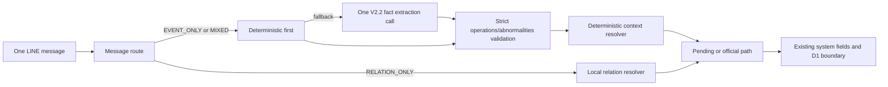

# Ambient Extraction V2.2 — Orthogonal Fact Model

Status: `DEV-ONLY LOCAL PROTOTYPE`
Wire contract: `2.2`
Architecture review: `PASS`
Provider calls in this round: `0`

## Scope and decision

V2.2 is a bounded developer-only prototype. It does not replace V2.1, alter
the Production Ambient path, migrate data, or authorize deployment. The
existing V2.1 wire and all historical evidence remain available for comparison.

The review finds that an operation (mortality/cull) and an abnormality are
orthogonal facts. They may be reported in the same LINE message, but the
abnormality does not automatically inherit the operation's quantity. V2.1's
homogeneous `events[]` representation is therefore a valid prototype with a
material multi-fact attribution concern, not proof that the whole architecture
is broken.

Decision for local evaluation:

```text
V2_2_ORTHOGONAL_FACT_MODEL = RECOMMENDED
V2_1_HOMOGENEOUS_EVENT_ARRAY_CONCERN = YES
ARCHITECTURE_PROVEN_BROKEN = NO
V2_2_ONE_AI_CALL_PER_MESSAGE = YES
V2_2_REQUIRES_TWO_MODEL_CALLS = NO
```

## Target flow



The model still receives one message as one semantic unit. `RELATION_ONLY`
messages do not make an event-extraction call. A mixed message can produce
new facts and a separate relation intent.

## V2.2 wire contract

The only model fact fields are:

```json
{
  "operations": [
    {"type": "mortality | cull", "quantity": "positive number | null"}
  ],
  "abnormalities": [
    {"detail": "short label", "quantity": "positive number | null"}
  ]
}
```

Both top-level arrays are required and the top-level and item objects use
`additionalProperties: false`. Operation items require `type` and `quantity`.
Abnormality items require `detail` and `quantity`; `detail` is a non-empty,
trimmed short label of at most 12 Unicode code points. An abnormality's
quantity may be `null` when the count is unknown. Operations and abnormalities
do not share a quantity by implication.

The schema intentionally does not encode conditional `detail` rules with
`oneOf`, `if/then/else`, or other large constructs. The small wire schema
handles shape and basic type constraints; the V2.2 validator handles enum,
quantity, detail-content, and business-semantic validity.

## Responsibility boundary

The model extracts only the two fact collections. The system derives or
retains source identity, LINE event identity, user, timestamp, group, farm,
house, flock, lineage, quantity confidence, candidate lifecycle, relation
identity, audit fields, dedupe, and transaction state.

After validated wire parsing, the local prototype can normalize operations and
abnormalities into the existing internal system-event shape. That mapping adds
system fields; it does not repair invalid JSON, infer a quantity, merge facts,
or modify the V2.1 contract.

## D04 decomposition

The historical V2.1 Ground Truth remains unchanged: its D04 event list still
records cull quantity 2 and abnormal quantity 2 with the frozen detail. The new
V2.2 Ground Truth is version `2.2.0` because it separates fact extraction from
cross-fact quantity attribution:

- fact extraction expects cull quantity 2;
- fact extraction expects abnormal detail `腳傷` with quantity `null`;
- cross-fact quantity attribution is a separate `UNRESOLVED` layer in this
  prototype.

This is a new acceptance projection, not a rewrite of the old result. No rule
copies the cull quantity to the abnormality. A future attribution decision
requires its own evidence and Ground Truth version.

### Fact identity versus quantity attribution

The generic V2.2 comparator now treats an operation identity as `type` plus its
own quantity, while an abnormality identity is its `detail` plus multiplicity.
An abnormality quantity is evaluated separately only when an explicit
attribution expectation is supplied. This prevents a valid abnormality from
being marked as a missing fact merely because its cross-fact quantity is still
unknown.

For D04 this means:

```text
cull/2 + 腳傷/null -> fact extraction PASS; attribution UNRESOLVED
cull/2 + 腳傷/2    -> fact extraction PASS; attribution PASS
cull/2 + 腳傷/3    -> fact extraction PASS; attribution FAIL
cull/2 only       -> fact extraction FAIL; attribution NOT_EVALUATED
```

The evaluator performs no quantity copying, event splitting, or semantic
dedupe. These are classification results only.

### Prompt alignment

The V2.2 developer-only prompt now contains exactly two architecture-alignment
rules: coexisting operation and abnormality facts must remain in their
respective collections, and an abnormality quantity may be numeric only when
the source directly supplies that abnormality quantity; otherwise it is null.
There are zero canonical examples in this prompt. This is
`V2_2_WIRE_CONTRACT_ALIGNMENT`, not a D04-specific semantic patch.

## Failure boundaries

- Malformed/truncated JSON, invalid top-level shape, missing arrays, unknown
  keys, and invalid item shape fail the complete response closed.
- Valid JSON with an invalid enum, quantity value, or abnormality detail may
  retain independently valid facts in the parsed message result as semantic
  partial success. This is not JSON salvage.
- A provider transport failure affects only its message result. There is no
  same-run retry in this prototype.
- A context failure does not erase a valid semantic fact. It marks context
  unresolved and prevents an unsafe official assignment.

## Relation and dedupe

Relation is not a second fact collection and is not an AI-generated target
reference. The existing relation cue detector and bounded local resolver remain
the first path. D06 remains `RELATION_ONLY`, makes zero event-extraction calls,
and can resolve to one pending D05 candidate under the existing scope.

Technical idempotency uses source identity and event ordinal. Two different
source messages with the same type and quantity remain independent. There is
no semantic tuple dedupe, automatic quantity propagation, or automatic event
split heuristic.

## Architecture comparison

| Concern | V2.1 homogeneous `events[]` | V2.2 orthogonal facts | Review result |
| --- | --- | --- | --- |
| One message / one call | one call | one call | V2.2 preserves |
| Operation vs abnormality | same item family | separate collections | V2.2 clearer |
| Small-model schema burden | shared nullable detail and event-specific rules | two small item shapes | V2.2 lower |
| Multi-event enumeration | possible, but one list boundary | possible in each collection | both require testing |
| Cross-fact quantity | easy to imply or copy accidentally | explicit separate decision | V2.2 isolates risk |
| Detail rules | conditional inside one item family | abnormality-only item | V2.2 clearer |
| Failure isolation | message-level if implemented | message-level if implemented | unchanged |
| Relation | separate route in current implementation | unchanged | reuse |
| Auditability | needs item interpretation | fact family is explicit | V2.2 improves |
| Migration cost | none while dev-only | none while dev-only | map first |
| Latency/cost | one possible AI call | one possible AI call | no required increase |

The alternatives reviewed were: retaining V2.1 unchanged, splitting each
message into two model calls, adding a larger conditional schema, and using the
V2.2 two-collection wire with one call. The final alternative is preferred.
Two model calls would increase latency, cost, coordination, and failure
surfaces without being required by the domain. A larger conditional schema
would increase small-model burden. Retaining V2.1 leaves the demonstrated
cross-fact attribution concern unresolved.

## Existing components to reuse

The prototype reuses the existing message input, conservative deterministic
fast-path planning, route classifier, relation cue detector, bounded relation
candidate resolver, context resolver, technical source-idempotency mechanism,
system-event field construction, and message-level partial-success boundary.
It adds no package, table, queue, cron, recovery layer, or provider call.

V2.1, Production V1, and the historical `decisions[]` path are not removed.
They remain current deviations and future retirement candidates only after a
separate acceptance and transition decision.

## Ground Truth and acceptance

The new frozen artifact is:
`forensics/ambient-extraction-v2-2-ground-truth-2026-08-28.json`.

It records DEV-SMOKE-8, all 13 existing Fresh Unseen cases projected into the
new fact families, and local cases for null quantities, three facts in one
message, and the D04 attribution boundary. The previous V2 Ground Truth was
not edited. `D04` remains high-risk, and a failure cannot move the expected
result during a test.

The local acceptance covers empty output, known/null quantities, operation and
abnormality multiplicity, strict keys/enums, Unicode code-point detail limits,
malformed responses, relation-only and mixed routing, bounded relation pools,
technical idempotency, context separation, partial success, no semantic
dedupe, and no automatic quantity propagation.

## No Production activation

`src/ambient-extraction-v2-2.ts` is not imported by `src/index.ts`. The
prototype is not a Production prompt, does not change the Production model or
schema, and performs no D1/Candidate/Buffer/Queue/LINE operation. There is no
migration and no deployment.

## Next gates

The next controlled gate, if separately authorized, is one real V2.2 D04 fact
extraction call using the existing safe Direct REST harness. It must report
fact extraction separately from quantity attribution. Full V2 smoke, Fresh
Unseen, model replacement, human LINE acceptance, and Production activation are
not authorized by this prototype.
