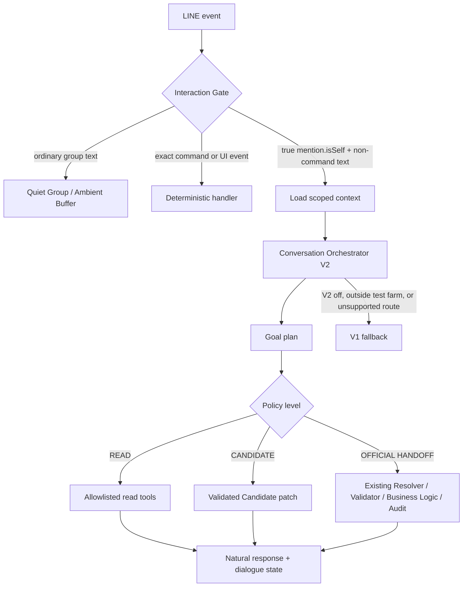

# Conversation Orchestrator V2

Status: deployed to Worker `313081eb-f589-4c5f-a68c-4b2a539a6eb7` with `CONVERSATION_V2_MODE=test_farm`; local completeness tests and Production read-only verification pass. Real mobile V2 Smoke remains pending.

This document records the implementation boundary. It does not replace the full system report.

## CURRENT RESPONSE COMPLETENESS CLOSEOUT — 2026-08-24

The eligible V2 path now owns every non-handoff outcome. Capability requests use
the V2 help renderer; unsupported or underspecified read requests use a V2-owned
safe read-only response; no-candidate and no-session reads persist bounded session
metadata instead of returning into the legacy generic fallback. AI/schema failure
therefore falls back to deterministic safe interpretation, then to the V2-owned
unknown-read renderer when needed.

The only intentional `null` returns in the orchestrator are explicit handoffs to
the existing deterministic business path: Quick Record observations/corrections/
selections, explicit Candidate/business actions, and commands controlled before
V2. An open Candidate remains context, not a mode lock. A concrete Quick Record
observation can still open the existing workflow after V2 has had its AI-first
opportunity, including when an older Quick Record session has expired.

This closeout uses the existing `line_events.conversation_routing_json` and
`conversation_v2_traces`; no migration was added. Routing metadata records the
eligibility decision, planner/AI timing and validation, selected goal/topic,
renderer, fallback, session status, outcome kind, and trace-save status. It does
not store prompts, hidden reasoning, secrets, tokens, or ordinary group
transcripts.

Local evidence for this release: Worker Vitest 293/293, Conversation V2 runtime
36/36, Menu 65/65, Quick Record 25/25, Quiet/Ambient 24/24, Manual Ambient
28/28, Scheduled Ambient 5/5, Digest V2 16/16, Candidate Repair 15/15,
Conversational Preview 11/11, Fast Path 12/12, Daily Review 9/9, Reliability
24/24, Web unit 11/11, Web Playwright 21/21, and Web build PASS. These are not
real mobile LINE acceptance. The deployed Worker is `313081eb-f589-4c5f-a68c-
4b2a539a6eb7` at 100% traffic; `/health` is HTTP 200 and `/ready` remains HTTP
503 only because six retained rows remain unresolved. No Production official
event, Candidate, Finance row, or retained row was changed by this release.

## Root cause in V1

The observed loop was a routing-order defect, not a missing list of Chinese phrases.

The previous path in `src/index.ts` was:

```text
LINE mention.isSelf
  -> handleCommand
  -> handleAmbientCandidateTextInput
  -> handleConversationalAgentInput
  -> handleAmbientUniversalCandidateInput
```

`handleConversationalAgentInput()` calls `routeConversationalGoal()` from `src/conversational-agent.ts`. That router calls the Candidate repair route first. The repair route calls `parseCandidateRepairIntent()` in `src/candidate-workflow.ts`; generic issue language can become `select_field` without identifying a field. The handler then calls `renderCandidateEditMenu()`, whose response is `你想修改哪一項？已知的其他資料會保留。`.

As a result, an open Candidate was treated as a modal repair workflow. Explain, show-state, and advice turns were swallowed before the system could read the Candidate context. The pre-repair call order in `handleCommand()` was:

```text
unknown explicit @Bot text
  -> handleConversationOrchestratorV2Input()
  -> V1 handleConversationalAgentInput() fallback
  -> V1 universal Candidate repair fallback
```

The exact system commands, Postback, Quick Reply, active Quick Record, Pending, Daily Review correction, and ordinary Ambient routing remain ahead of this conversational branch.

## V1 and V2 architecture



The key invariant is `OPEN CANDIDATE IS CONTEXT, NOT MODAL LOCK`.

## Goal model and routing

`src/conversation-v2.ts` defines the bounded goal union:

`EXPLAIN`, `QUERY`, `SHOW_STATE`, `ADVISE`, `REPAIR`, `RECORD`, `CANCEL`, `CONFIRM`, `NAVIGATE`, `CLARIFY`, `HELP`, `COMPARE`, `ANALYZE`.

`routeConversationV2Deterministic()` remains a bounded local policy/fallback after the model call. It applies broad linguistic features and current context, not the observed full benchmark utterances as production branches. `handleConversationOrchestratorV2Input()` invokes `classifyConversationV2WithAi()` first for explicit non-command mentions; `chooseSafeConversationV2Plan()` then validates and protects the safe mutation boundary from a model mutation guess.

| Goal | Read tools | Candidate draft mutation | Official mutation | Confirmation |
|---|---:|---:|---:|---:|
| EXPLAIN | yes | no | no | no |
| QUERY | yes | no | no | no |
| SHOW_STATE | yes | no | no | no |
| ADVISE | yes | no | no | no |
| COMPARE / ANALYZE | yes | no | no | no |
| REPAIR | yes as needed | validated patch only | no | existing Candidate flow |
| CANCEL | yes | terminal Candidate action | no | explicit user action |
| RECORD / official correction | yes | no direct official write | handoff only | existing business rule |

## Dialogue state

Migration `0025_conversation_v2_sessions.sql` adds a bounded session keyed by:

```text
organization_id + line_group_id + line_user_id
```

It stores only routing context:

```text
active_object_type / active_object_id
last_goal
last_topic
last_action
last_tool
last_tool_result_summary
last_explained_issue
last_referenced_field
turn_count
updated_at / expires_at
```

The rolling TTL is 30 minutes. It is not a transcript archive and does not store the ordinary 24-hour Ambient chat body. Candidate Inbox remains a group-level work item; the dialogue pointer is user-scoped so one user’s referent does not silently become another user’s referent.

Reference examples supported by the state are “這個／那個／剛才／現在呢／那就…”. With one open Candidate it is selected safely. With multiple open Candidates the handler renders a selection rather than guessing.

## Plan schema and tools

`ConversationV2Plan` is validated locally before any action:

```json
{
  "goal": "EXPLAIN",
  "target": "candidate",
  "topic": "candidate_conflict",
  "requestedTools": ["get_candidate_details", "get_candidate_evidence"],
  "proposedAction": null,
  "needsClarification": false,
  "confidence": 0.91
}
```

The allowlist in `CONVERSATION_V2_TOOL_ALLOWLIST` contains read tools and Candidate-draft tools only. The official tool list is intentionally empty. Unknown tools, fields, goals, targets, malformed JSON, and read plans carrying a mutation are rejected.

Candidate actions are handed to existing functions in `src/index.ts`, including `applyAmbientCandidatePatch()`, `dismissAmbientCandidateClue()`, `cancelAmbientCandidate()`, and the existing Postback/business path for confirmation. No V2 path has a raw SQL, official event update, Finance mutation, or master-data mutation tool.

## Authority and caretaker clue policy

The effective priority is:

```text
explicit user decision
  > verified Resolver / database fact
  > deterministic inference
  > Ambient / AI clue
```

`src/ambient.ts` treats caretaker text as provenance/clue. `resolveAmbientCandidateEntity()` only treats it as a blocking relation while it is active and unresolved. A legal explicit Farm selection stores `userOverrides.farm.status = selected`, preserves the caretaker clue, marks the caretaker clue overridden, and lets the explicit Farm win. `dismissAmbientCandidateClue()` preserves provenance while making the clue non-blocking. Database organization, authorization, Farm/House/Flock ownership, and other hard invariants still cannot be overridden.

## Loop breaker and response behavior

Each V2 response persists `lastGoal`, `lastTopic`, `lastAction`, and a bounded issue summary. A follow-up question inherits the previous topic only when it is referential. A bare issue assertion becomes a Candidate clarification rather than repeatedly emitting the same repair menu. Explain/show-state/advice responses are natural-language reads; advice about cancellation presents a Quick Reply but does not cancel.

Examples:

```text
EXPLAIN: 什麼衝突？
SHOW_STATE: 你現在知道這筆哪些資料？
ADVISE: 我如果現在不想記這筆可以怎麼辦？
CANCEL: 那就不要記了。
REPAIR: 改成金雞測試場。
```

The first three do not mutate Candidate or official data. Only the last two may reach validated Candidate actions, and confirmation still uses the existing official write gate.

## Model boundary

Ambient extraction keeps its existing model path. The V2 classifier uses `CONVERSATION_MODEL`, currently configured to the same pinned model:

```text
@cf/meta/llama-3.2-3b-instruct
```

The V2 request uses prompt-constrained JSON, safe extraction, and strict local validation. It does not use `response_format: json_schema`. There is no bulk AI benchmark. The abstraction allows a future explicit-conversation model change without changing Ambient extraction.

## Rollout

`wrangler.jsonc` sets:

```text
CONVERSATION_V2_MODE=test_farm
```

The gate uses the Farm `environment = 'test'` marker, the current Candidate’s resolved/text Farm, an explicit test Farm query, or a test Farm group binding. Production Farm candidates fall through to V1. This is a reversible configuration rollout; no schema rollback is required.

## Evaluation evidence

`scripts/conversation-v2-eval.mjs` runs `src/conversation-v2-eval.test.ts`.

- 66 varied single-turn utterances across EXPLAIN, SHOW_STATE, ADVISE, QUERY, REPAIR, CANCEL, RECORD, CLARIFY, HELP, COMPARE, and ANALYZE: 66/66, 100%.
- 15 multi-turn conversations, 34 turns, including antecedent conflict, advice versus action, current-state follow-up, multiple read queries, and explicit cancellation: 34/34, 100%.
- `src/conversation-v2-anti-hardcoding.test.ts` checks that the observed full benchmark utterances are not embedded in `conversation-v2.ts` production branches.
- `src/conversation-v2.test.ts` validates plan schema rejection, empty official tool allowlist, read-only safety, Candidate context routing, explicit cancel, and explicit Farm repair.

The evaluation is a bounded routing harness, not proof of human-level language understanding. The production-equivalent local runtime is the stronger gate: it starts from a true-mention LINE envelope and asserts final response diversity and no mutation. Real LINE statuses remain `PENDING_REAL_REVIEW` until the Test Farm device scenarios are performed.

## Runtime evidence

`scripts/conversation-v2-runtime-local.mjs` uses local D1 and the Test Farm fixture:

- explicit Farm override preserves known quantity and writes no official record;
- EXPLAIN and SHOW_STATE return conflict/evidence context without mutation;
- follow-up “what conflict” uses the prior topic;
- ADVISE presents cancel options and leaves Candidate open;
- explicit CANCEL terminalizes the Candidate while source remains consumed;
- a later independent same-value source creates a new Candidate;
- generic Candidate issue text reaches a clarification menu;
- runtime result: 18/18 PASS.

No remote official operational event was created by these tests.

## Known limits

1. V2 is intentionally enabled for Test Farm only. Production Farms remain on V1 until real-line review passes.
2. The 3B model is not benchmarked in bulk. If the real multi-turn review shows a model-capability limit, the minimal upgrade is to change only `CONVERSATION_MODEL`; Ambient remains on its current model and safety gates remain unchanged.
3. `顯示待摘要訊息` and the expired-buffered diagnostic remain separate existing scope; this document does not change their retention or expired-row policy.

## Completion pass: evidence, memory, grounded responses, and traceability

The completion pass is additive to the V2 control plane; it does not change Ambient extraction semantics, the official write path, Finance, Weather, or the Test Farm rollout gate.

### Evidence-first explanation

`AmbientCandidate` now carries bounded `caretakerClues[]`, `evidence[]`, and `conflictEvidence[]` in `candidate_json`. `resolveAmbientCandidateEntity()` enriches missing provenance from the already selected source rows, then creates structured conflict evidence. `getCandidateConflictEvidence()` reads that object plus verified caretaker/Farm relations. Legacy label-only rows are explicitly reported as insufficient; names are never guessed.

### Semantic working memory

Migration `0026_conversation_evidence_observability.sql` adds `semantic_memory_json` to `conversation_v2_sessions`. The rolling 30-minute group/user session now stores the last grounded response summary, conclusion, evidence references, blocking status, recommended options, and explicit decision in addition to goal/topic/object pointers. `為什麼？` therefore receives the previous explanation summary and evidence references rather than only a topic label.

### Grounded response boundary

`src/conversation-composer.ts` is a deterministic grounded response composer. It consumes only validated Candidate evidence, structured conflict, resolution facts, business rule, and bounded memory. SHOW_STATE, EXPLAIN/QUERY, and ADVISE have separate response strategies. Read and advice paths do not mutate Candidate or official records; response-composer failure cannot collapse all goals into the old state template because each goal has its own bounded fallback.

### Production-safe trace

Migration `0026_conversation_evidence_observability.sql` adds `conversation_v2_traces`. `writeConversationV2Trace()` records safe hashes, plan metadata, tool names, policy, renderer, mutation counts, duration, error class, and seven-day expiry. It does not store tokens, secrets, ordinary chat transcript, or chain-of-thought. See `docs/CONVERSATION_PRODUCTION_TRACE.md` and `docs/CONVERSATION_EVIDENCE_MODEL.md`.

### Expired Ambient diagnostic

`runAmbientDigest()` writes a metadata-only `ambient_expiry_diagnostics` tombstone before deleting an expired buffered source. Raw Ambient retention remains 24 hours. `顯示待摘要訊息` reads the tombstone section without restoring raw text, running AI, acquiring a lease, consuming a source, or creating a Candidate.

### Local completion evidence

After this pass the local gates are Vitest 215/215, Conversation V2 production-equivalent runtime 21/21, and Conversational Preview 10/10. These are local D1 gates only; real LINE acceptance remains pending until the Test Farm device script is repeated.

## Final Production release evidence — 2026-08-21

The completion pass was deployed as Worker `d642aa43-eaae-4f7b-aa1b-76f1f034c3db` at 100% traffic with `CONVERSATION_V2_MODE=test_farm`. Migration `0026_conversation_evidence_observability.sql` was applied remotely. Health returned HTTP 200. Cron expressions remain `0 * * * *` and `30 12 * * *`; Queue remains `chicken-line-events` with `max_batch_timeout=0`.

Production verification is read-only. D1 currently has 8 Production Farms and 1 Test Farm; official counts remain 52 operational events and 3 abnormal events. Audit is 28 because the release migration added `audit-migration-0026`; no official event was written. Ambient source counts are processed 8 and buffered 0. Candidate counts are pending 1 and ignored 1. The current pending Candidate is a legacy evidence-incomplete row and was deliberately not modified.

The real 2026-08-21 Daily Review is durable: `delivery_status=sent`, one delivery attempt, `sent_at=2026-08-21 12:30:32 UTC` (20:30:32 Asia/Taipei), no active lease, and no error. Finance remains allocated `434838.6`, expense `5500`, net `429338.6`.

Real device acceptance remains pending. Automated and local production-equivalent evidence cannot replace the Test Farm LINE script.

## CURRENT COMPLETION PASS — speech acts, query safety, and general working memory — 2026-08-22

This section is the current implementation record for the completion pass. It supersedes older local test counts and deployment snapshots above; historical sections remain for audit history.

### Control-plane boundary

src/index.ts now sends an explicit @AI non-control/non-admin message through handleConversationV2() before the legacy semantic/query/record handlers. The V2 path classifies the speech act first (ASSERT, QUERY, EXPLAIN_REQUEST, ADVICE_REQUEST, REFERENCE, CORRECTION, CANCEL, CONFIRM, NAVIGATION, META_CONVERSATION, UNKNOWN), then applies deterministic policy and existing business handlers. Exact system commands and structured Postbacks remain deterministic fast paths. Ordinary unmentioned group text remains Quiet/Ambient input.

An open Candidate or Pending item is loaded as context, not a modal lock. The only intentional continuation shortcut is the narrow existing Quick Record boundary: a concrete observation, correction, or resolver selection can return to the established Quick Record path. It is not a general conversation fallback.

### Query / record safety

conversationOfficialRecordAllowed() is the final write gate. It requires ASSERT + RECORD and rejects questions, conditionals, hypotheticals, quoted text, negation, and unresolved referential speech. QUERY, EXPLAIN, SHOW_STATE, ADVISE, COMPARE, ANALYZE, HELP, NAVIGATE, and CLARIFY have no official-write or Candidate-mutation path; trace metadata is the only permitted write. The official path remains Resolver → Validator → existing Business Logic → D1 → Audit.

### General semantic working memory

conversation_v2_sessions.semantic_memory_json now carries bounded object-aware memory: active object type/id/summary, last query result/type, referenced object/type/field, explained object and issue, conclusion, evidence references, blocking status, recommended options, action proposal, explicit decision, question type, pending object, and assistant response summary. The existing organization/group/user scope and rolling 30-minute TTL remain. This supports referents such as 那筆, 那個, 它, 為什麼, and 現在呢 without storing a permanent transcript.

### Local acceptance evidence

- Worker TypeScript + Vitest: 246/246 PASS.
- Conversation V2 targeted tests: 53/53 PASS.
- Adversarial safety evaluation: 100/100; unsafe official approvals 0; Query/Explain/Advice/Meta/Compare false-write counters 0.
- Natural-language evaluation: 66/66; multi-turn evaluation: 34/34.
- Production-equivalent Conversation V2 runtime: 26/26 PASS.
- Menu 59/59, Quick Record 25/25, Quiet/Ambient 24/24, Manual Ambient 28/28, Scheduled Ambient 5/5, Digest V2 16/16, Candidate Repair 15/15, Conversational Preview 11/11, Daily Review 9/9, Reliability fault tests 24/24.
- Web unit 11/11, Web Playwright 15/15, Web build PASS.

These are local and production-equivalent gates; they are not real LINE human acceptance.

### Current deployed verification

Migration 0030_conversation_safety_trace.sql is additive and applied remotely. The current deployed Worker is 6b5091a1-580f-4969-864a-05e8dd2be193 at 100% traffic; CONVERSATION_V2_MODE=test_farm and CONVERSATION_MODEL=@cf/meta/llama-3.2-3b-instruct are unchanged. /health is HTTP 200. /ready is HTTP 503 because seven retained events remain unresolved; stalled messages, delivery-uncertain messages, and recent reply problems are zero. No retained event was changed by this release.

Production read-only D1 verification returned 8 production Farms, 1 Test Farm (金雞測試場, environment=test), 60 operational rows, 8 abnormal rows, 56 audit rows, Ambient processed=7 and buffered=0, and Candidate statuses confirmed=1, ignored=1, pending=1. Finance remains 434838.6 / 5500 / 429338.6. All verification queries reported zero rows written and changed_db=false. conversation_v2_traces currently has zero rows because no new explicit V2 Production turn occurred after deployment; this is an observed empty state, not a disabled trace claim.

## Group rollout gate and durable routing evidence

The rollout contract is now group-scoped. `CONVERSATION_V2_MODE` remains the global
kill switch / rollout ceiling, while `line_groups.conversation_v2_enabled` is an
explicit, default-off group switch. Candidate presence, Farm binding, and Farm text
are context inputs after eligibility; none can enable V2. See
`docs/CONVERSATION_V2_GROUP_ROLLOUT.md` for the additive schema and admin toggle.

Every explicit self mention now leaves safe routing metadata in `line_events` and,
when dispatch is reached, a matching `conversation_v2_traces` row. This includes
ineligible events and records the structured skip reason, planner/AI attempt,
session read/write status, fallback origin, and trace-save status. It does not store
ordinary group transcript, credentials, tokens, or hidden model reasoning.

Real LINE statuses remain PENDING_REAL_REVIEW. No Production Candidate was confirmed, cancelled, or edited; no official synthetic event was created.

## CURRENT INSTRUCTION-FOLLOWING CLOSEOUT — 2026-08-24

This pass adds a bounded answer contract rather than phrase-specific production
branches. The contract records answer mode, bounded requested counts, example /
capability / limitation intent, summary and reason requests, consequence versus
options, brevity, and an explicit read-only instruction. Counts are clamped to
1–10 and affect only response shape; they never grant a tool or mutation
permission.

Capability responses now have separate generic, practical-example, and
capability-plus-limits variants. A request for three examples produces three
actual safe questions; a request for two capabilities and two limits produces
two items in each section. The renderer uses the existing capability response
path and does not duplicate the menu or business handlers.

Broad operational questions such as “今天有沒有需要注意的事” use a bounded
`today_attention` read plan. It reads current-organization, local-day mortality
and abnormal aggregates, open pending context, and a small recent window using
allowlisted helpers. It does not read Finance, scan unbounded history, generate
SQL from model output, or write data. The response states the effective scope
and distinguishes no-data from insufficient-data results.

Consequence questions are classified as EXPLAIN with answer mode `consequence`;
they explain effects based on the actual Candidate lifecycle. Options and
recommendation questions are classified as ADVISE with answer mode `options`;
they present safe choices and never execute them. A sentence mentioning
“取消” remains explanatory when its speech act asks what would happen.

Working memory remains group/user scoped with the existing rolling 30-minute
TTL. A relevance gate now distinguishes memory used for routing from memory
shown in the response. Prior conclusions are included only for referential
follow-ups such as “為什麼？” or “那個呢？”; a new request for examples,
capabilities, or today’s attention does not echo an unrelated previous answer.

The same bounded metadata is persisted in the existing
`line_events.conversation_routing_json`; no migration was added. Local gates
for this pass are Worker Vitest 349/349, Conversation V2 runtime 40/40,
Menu 65/65, Quick Record 25/25, Quiet/Ambient 24/24, Manual Ambient 28/28,
Scheduled Ambient 5/5, Digest V2 16/16, Candidate Repair 15/15,
Conversational Preview 11/11, Fast Path 12/12, Daily Review 9/9,
Reliability 24/24, Web unit 11/11, Web Playwright 21/21, Web build PASS,
and Wrangler dry-run PASS. These are automated/local gates and do not replace
the post-deploy mobile true-mention review.

Deployment verification: Worker `0d876d84-cc4c-4f81-852c-11cb65a8dde3` is at
100% traffic; `/health` is HTTP 200 and `/ready` is HTTP 503 only for the known
six unresolved historical retained messages (`actionableUnfinishedCount=0`).
Queue, Cron, `test_farm` mode, and the pinned 3B model are unchanged. Remote
read-only checks show 60 operational rows, 8 abnormal rows, 60 audit rows,
Finance `434838.6 / 5500 / 429338.6`, one enabled V2 group, and no new event or
V2 trace after deployment. No migration was added; remote latest remains
`0031_conversation_v2_group_rollout_observability.sql`. No official synthetic
Production write was made. The next step is the real phone instruction smoke,
not an automated claim of conversational acceptance.
