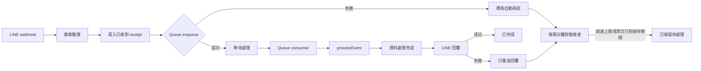

# LINE 訊息可靠性與恢復設計

> 目前有效版本：0028 收尾。本文前面保留 incident 歷史，後面的 0028 收尾規則優先於較早的 0027 描述。

## 0. 0028 收尾摘要

這次不是把 `/health` 做成「看起來正常」，而是把一則 LINE 訊息拆成可以逐筆查證的結果：

```text
已收到 → 等待處理 → 正在處理 → 資料處理完成 → LINE 回覆完成
                         ↘ 暫時失敗，自動再試
                         ↘ 多次失敗，已保留待處理
```

### 這次新增的安全邊界

- `migrations/0028_line_reliability_closeout.sql` 只做 additive schema；不修改或刪除 0001–0027，也不改正式營運資料。
- Webhook 先在 `line_events` 建立 durable receipt；Queue 只傳 `{eventId, correlationId}` 參照信封。舊的完整事件信封仍可讀，避免 backlog 遺失。
- `webhookEventId`／`event_id` 是去重主鍵，不使用 Queue message id 判斷是否重複。
- `business_outcome` 與 `reply_outcome` 分開。資料已完成但回覆失敗時，後續只重送已保存的回覆，不重做正式寫入。
- Reply、Push、警示訊息、重新顯示共用 `reply_owner + reply_lease_until` 原子租約；Queue、每兩分鐘恢復工作與 Web 手動恢復不能同時發送同一筆。
- Push 在呼叫前保存固定 `X-Line-Retry-Key` 與固定訊息內容；2xx 或同鍵 409 視為已接受。
- Reply 的 timeout、連線中斷與 5xx 只標成「結果不明」，不直接把同一答案再 Push 一次；系統只送一次不同的延遲警示，使用者按「重新顯示」才重新送保存的答案。
- 明確判定 Reply 沒送出（例如無效／過期 token 的 4xx）才可安全改用原答案 Push。
- `conversation_v2_traces`、`line_event_delivery_attempts` 與 `line_events` 共用 correlation id；保存狀態、階段、HTTP status、LINE request id、錯誤分類與時間，不保存 token、secret、完整普通聊天或隱藏推理。

### 舊資料的誠實標記

0027 曾把有 `processed_at` 的舊資料標成 `sent`，但其中 322 筆沒有 `reply_attempted_at` 證據。0028 將這類資料改為 `reply_outcome='legacy_unknown'`，不把「曾完成處理」冒充「LINE 已接受回覆」。目前 8 筆已過期的舊 receipt 仍保留 metadata；管理者可在 Web 按「我已查看」，這只解除 readiness 警示，不刪資料，也不會自動重播。

### 官方 LINE 行為依據

- LINE 建議 webhook 盡快回 2xx、把後續處理非同步化；官方 webhook error statistics 的 timeout 門檻是 2 秒。
- Reply token 原則上只能使用一次，且應在 1 分鐘內使用；Push 的 retry key 可讓同一請求安全重試，同 key 被接受後可能回 409。
- Webhook redelivery 是否開啟仍需管理者在 LINE Developers Console 人工確認；程式只依 `webhookEventId` 去重，不能假設 Console 設定。

正式來源：[LINE webhook receiving](https://developers.line.biz/en/docs/messaging-api/receiving-messages/)、[LINE retry failed API requests](https://developers.line.biz/en/docs/messaging-api/retrying-api-request/)、[Messaging API reference](https://developers.line.biz/en/reference/messaging-api/nojs/)、[webhook timeout guidance](https://developers.line.biz/en/docs/messaging-api/check-webhook-error-statistics/)。

本文件記錄本輪可靠性完成項，對應 `0027_line_reliability.sql`。它描述的是實際程式路徑，不是只描述理想架構。

## 1. 本輪處理的 Production Incident

2026-08-21 約 22:45（Asia/Taipei），`@Bot 摘要` 收到 webhook，但 Worker invocation 在等待 `env.EVENTS.send()` 約 1.953 秒後被取消。之後幾則訊息在約 22:49 一起回覆。當時沒有程式修改、部署或 migration，因此這是原有 Webhook → Queue enqueue 邊界的可靠性問題；不是 Conversation V2、Candidate 或 LINE Reply API 已被證明的根因。

仍有兩項歷史未知不能由這次修復倒推：incident window 另有一筆 `D1_ERROR: internal error`，以及原始指標 `63 ingested / 59 acknowledged` 尚未能逐筆對應。這兩項只能透過新的 correlation id 與狀態資料避免再次發生，不能在沒有證據時指定為唯一根因。

## 2. 實際生命週期

`src/index.ts` 的 webhook handler 先驗證簽章，再呼叫 `ensureLineEventReceipt()`；只有 receipt 寫入 D1 成功後，才會把 enqueue 工作交給 `ctx.waitUntil()`。沒有 `ctx` 的 local harness 會等待 enqueue，方便測試；Production 由 Worker context 監督背景工作。



目前 D1 `line_events` 可區分：

| 狀態 | 意義 |
|---|---|
| `received` | 已收到且 receipt 已寫入 D1 |
| `queued` | 已安排進訊息處理 |
| `processing` | 正在執行業務處理 |
| `reply_pending` | 資料處理完成，等待 LINE 回覆 |
| `retry_waiting` | 這一階段暫時失敗，等待有限次重試 |
| `reply_completed` | 業務處理與 LINE 回覆都完成 |
| `retained` | 多次失敗或原始訊息已過保存期限，已保留處理紀錄 |

`business_status` 與 `reply_status` 分開保存。正式資料完成但 LINE 回覆失敗時，下一次只讀取 `reply_payload_json` 重送，不重新執行正式寫入。

## 3. 實際程式位置

| 能力 | 檔案與 function | 實際行為 |
|---|---|---|
| Durable receipt | `src/reliability.ts` `ensureLineEventReceipt()` | `INSERT OR IGNORE` 寫入 `line_events`，建立 correlation id 與 24 小時 payload 到期時間 |
| Webhook enqueue | `src/index.ts` `fetch()` `/webhook/line` | 一般事件在 receipt 成功後才 `ctx.waitUntil(EVENTS.send(...))`；管理者密碼續接不進 Queue，只在受監督背景工作中短暫使用原文 |
| 事件 claim | `src/reliability.ts` `prepareLineEvent()` | 原子 claim `received/queued/retry_waiting`；同時避免兩個 consumer 同時重跑；已完成業務只走 reply-only |
| 業務／回覆分離 | `markBusinessCompleted()`, `markReplyAttempted()`, `markReplyCompleted()` | 先保存回覆 payload，再送 LINE；回覆失敗不重做業務 |
| Consumer retry | `src/index.ts` `queue()` | 失敗事件依階段記錄，未達上限 `message.retry()`，已保留則 ack，避免 Queue 無限重播 |
| Watchdog | `src/reliability.ts` `recoverStalledLineEvents()` | 每次少量找出卡住事件，使用 recovery lease 後逐筆重新排入 Queue |
| Cron routing | `src/daily-review.ts` `scheduledJobForCron()`; `src/index.ts` `executeScheduledJob()` | `*/2 * * * *` 只進 recovery branch；不會跑 Ambient、Weather 或 Daily Review |
| 手動恢復 | `src/web-api.ts` `recoverUnfinished()`; `src/reliability.ts` `manuallyRecoverLineEvents()` | 既有登入／管理權限後，只重排仍有 payload 且尚無 durable success 的事件 |
| 系統狀態 | `src/reliability.ts` `getReliabilityStatus()` / `formatReliabilityStatusForLine()` | 對 Web 與管理者 LINE 顯示正常、較慢或需要處理 |
| Readiness | `src/index.ts` `/ready` | 同時檢查 D1、卡住事件與保留事件；失敗回 HTTP 503；`/health` 只表示 Worker 活著 |
| Reply trace | `src/index.ts` `deliverTrackedReply()` | 保存回覆嘗試、成功／失敗、次數與錯誤分類，不保存 token |
| V2 trace correlation | `src/index.ts` `writeConversationV2Trace()` | Queue 傳入同一 correlation id；V2 trace 存 7 天安全 metadata |

## 4. 自動恢復規則

目前集中設定在 `src/reliability.ts`：

| 判定 | 閾值 |
|---|---:|
| 正常範圍 | 小於 10 秒 |
| 接收後尚未排入處理 | 30 秒 |
| 正在處理超過時間 | 120 秒 |
| 資料完成但回覆未完成 | 60 秒 |
| 恢復檢查 | 每 2 分鐘 |
| Queue 排入上限 | 5 次 |
| 業務處理上限 | 3 次 |
| LINE 回覆上限 | 3 次 |
| 重試等待 | 5、10、20、40、60 秒封頂 |

這些是保守起始值，不是用來掩蓋即時延遲。`/ready` 會在有 stalled 或 retained 事件時回報未就緒，讓監控不會只看 `/health`。

恢復前會使用 `recovery_owner` 與 60 秒 lease 做逐筆 claim。重複的 watchdog、Queue redelivery 或 Web 連點只能有一個成功 claim；其餘會跳過。

## 5. 失敗保留與隱私

- LINE 原始事件 payload 最多保存 24 小時，從收到時間計算，不因重試重新延長。
- 原文到期但仍未完成時，轉成 `retained`，將 payload 改為 `{"redacted":true}`，並保留短期 metadata。
- 保留 metadata 7 天：事件／correlation 的安全識別、狀態、階段、錯誤分類、次數與時間。
- 原始訊息過期後不可再自動重播；這是隱私與可恢復性的明確取捨，Web 會顯示它已保留但不會假裝能重播。
- 管理密碼事件在 D1 receipt、處理紀錄與 Audit 都使用遮罩版本，且不進 Queue；只在受監督短暫工作中使用原文。不保存 token、secret 或完整 chain-of-thought。

## 6. 手動恢復

Web 管理後台新增「系統狀態」頁，沿用既有登入與管理權限：

- `GET /api/system-status`：只讀系統摘要。
- `GET /api/reliability/events`：只列安全短編號、時間、狀態、階段與再試次數，不回傳訊息內容。
- `POST /api/reliability/recover`：管理者執行逐筆安全重排；已完成事件會跳過。

管理者看到的是：

- `✅ 系統目前運作正常`
- `⚠️ 目前有些訊息處理比較慢`
- `❗ 有幾筆訊息尚未完成`
- `🔄 重新處理未完成訊息`

LINE 的 `系統狀態` 是第二入口，需先有現有管理者 session；Web 才是 LINE 整體故障時的主要 out-of-band 恢復入口。管理者密碼本身不會寫入 Queue、收據、處理紀錄或 Audit；若密碼續接的短暫背景工作失敗，管理者重新輸入即可。

## 7. 延遲回覆

事件收到超過 10 秒才第一次送回覆時，`claimDelayedReplyNotice()` 只會成功一次，回覆最前面加：

> ⚠️ 剛才系統短暫延遲，以下是稍早未完成的回覆。

同一事件的後續重試不會重複加這句。這能讓使用者知道延遲回覆不是新訊息。

## 8. 介面白話化

本輪將一般 LINE / Web / 待整理檢查頁中的技術詞改成白話：

| 內部值 | 使用者看到 |
|---|---|
| Open Candidate | 待確認資料 |
| buffered | 尚待整理訊息 |
| candidate-like | 可能與營運有關 |
| prefilter-excluded | 目前判定與營運無關 |
| Queue retry | 正在自動再試 |
| quarantined | 已保留待處理 |
| conflict | 資料不一致 |
| blocking | 目前還不能完成 |
| processed | 已完成整理 |
| error | 發生問題 |

品牌名稱、真實批次編號與明確的「技術診斷資料」可以保留；一般使用者畫面不需要知道 D1、Queue、Webhook、Consumer 或 Renderer。

## 9. `顯示待摘要訊息`

這個 exact command 仍然是純讀取，不寫 `line_events`、不呼叫 Ambient AI、不建立待確認資料、不取得摘要 lease、不 consume source。

它直接讀 `ambient_chat_buffer` 中仍為 `digest_status='buffered'` 且尚未到期的資料，並另讀 7 天內的 `ambient_expiry_diagnostics`。因此不會把過期原文留在 24 小時政策之外，但也不會讓「已過期仍未成功整理」完全消失。

一般畫面會顯示：

```text
🧪 尚待整理訊息檢查
尚待整理訊息：2 筆
【可能營運資訊】
08/22 15:41｜死亡5
判定：可能與營運有關

【目前判定與營運無關】
08/22 15:50｜等等去吃飯
判定：目前判定與營運無關

【⚠️ 已過期但未成功完成摘要】
08/21 08:00｜短編號：a1b2c3d4e5
判定：可能與營運有關｜最後問題：保存期限已到

尚待整理訊息：2
可能與營運有關：1
目前判定與營運無關：1
待確認資料：1
最近24小時已完成整理：8
已過期但未完成：1
本頁只查看，不會修改任何資料。
```

## 10. 不變更的範圍

- Conversation V2 model 沒有更換；目前仍由 `CONVERSATION_MODEL` 使用 `@cf/meta/llama-3.2-3b-instruct`。
- Ambient model、Finance、Weather、Quick Record 五分鐘規則與 Queue `max_batch_timeout=0` 沒有改動。
- Hourly Ambient、Daily Review 的既有 cron 保留；恢復是額外的 `*/2 * * * *` branch。
- 不會用 Production 建立 synthetic official event；正式資料的既有 idempotency、Resolver、Validator、Business Logic、Audit 仍是唯一寫入邊界。

## 11. 已知 residual risk

1. 若 D1 在 webhook receipt 寫入前完全不可用，Worker 不會回假成功；LINE 是否依官方 retry 再送，仍取決於 LINE webhook retry semantics，不能由本專案假設。
2. 若原始 payload 已過 24 小時才發現事件未完成，只能保留 metadata，不能在沒有原文的情況下安全重播。
3. 已成功業務寫入但 LINE 永久拒絕 reply token 時，系統能避免重複寫入，但不能保證原始 reply token 仍可用；Web 會保留結果供管理者查看。
4. `/health=200` 只代表 Worker 活著；應使用 `/ready` 與「系統狀態」頁判斷訊息鏈是否可用。
5. 過去 incident 的 `63 ingested / 59 acknowledged` 仍是歷史不可逐筆對照資料；0027 後新事件會使用同一 correlation id 串起來。

## 12. 本機故障注入與回歸證據

目前 `npx tsc --noEmit` 通過，Vitest 為 **240/240 PASS**。其中可靠性收尾涵蓋：receipt 先於排隊、Queue 失敗再試、重複 receipt／LINE redelivery 計數、舊／新 Queue 信封、D1 失敗上限、資料完成與回覆分離、reply-only 重試、Reply／Push 錯誤分類、固定 retry key、409 accepted、單一發送租約、重新顯示租約、delivery trace、延遲提示只出現一次、過期時保護 active lease、保留資料確認、token 移除與中文狀態。

故障注入判斷表：

| 情境 | 預期結果 | 本機證據 |
|---|---|---|
| receipt 寫入前 Queue 延遲 | 先留下已收到紀錄 | `reliability.test.ts` receipt test |
| Queue enqueue 失敗 | `retry_waiting`，恢復工作重新排入 | enqueue retry test |
| 重複 webhook | 同一事件，不重做業務 | redelivery/idempotency test |
| Queue 重播 | 不增加 webhook receive 次數 | redelivery test |
| D1 暫時錯誤 | 有限次重試 | D1 failure test |
| D1 多次錯誤 | `retained`，不刪原紀錄 | bounded failure test |
| 兩個恢復者同時執行 | 只有一個取得 lease | recovery／reply race tests |
| Reply timeout／5xx | 結果不明，不直接重送原答案 | outbound + reliability tests |
| Reply 4xx | 可判定未送出，才進 Push fallback | `LineApiError` test |
| Push 2xx／409 | 同一 retry key 視為接受 | retry-key tests |
| Push 結果不明 | 保存固定內容，送一次警示 | delivery state tests |
| 使用者重新顯示 | 同一 retry key、同一發送租約 | redisplay lease test |
| 業務完成後 Worker 中斷 | 後續只走 reply-only | business/reply split test |
| 回覆完成後 Worker 中斷 | 同鍵重試可由 409 收斂 | Push 409 test |
| batch 其中一筆失敗 | 單筆 retry，不影響已 ack 事件 | Queue consumer path |
| 原文到期 | metadata 保留、原文遮罩 | expiry tests |
| active recovery lease 到期前清理 | 不遮罩、不搶鎖 | expiry lease test |
| 保留歷史未查看 | readiness 保持 attention | retained acknowledgement test |
| 管理者確認保留資料 | 只改 metadata，不刪事件 | acknowledgement test |
| token 已使用／過期 | 不用舊 token，改走安全流程 | reply freshness path |
| 24 小時後原文 | 不再安全重播 | retention path |
| 新舊 Queue envelope | 都能處理，參照信封優先 | queue compatibility path |
| reply request id／status | durable delivery attempt | delivery trace test |
| exact preview command | 不進 receipt／Queue、不改資料 | preview path + existing preview gates |
| `/health` 與 `/ready` | liveness 與 readiness 分開 | endpoint + readiness tests |

這些是 local fault-injection／production-equivalent 證據，不是真人 LINE 通過證明。真人狀態仍為：

```text
REAL-LINE-RECOVERY-NORMAL: PENDING_REAL_REVIEW
REAL-LINE-SYSTEM-STATUS: PENDING_REAL_REVIEW
REAL-LINE-DELAYED-REPLY: PENDING_REAL_REVIEW
REAL-LINE-MANUAL-RECOVERY: 僅可用安全 Test fixture／非正式資料驗證
```

## 13. 0028 後維運操作

一般管理者只需使用 Web「系統狀態」：

1. 看「目前有幾筆訊息尚未完成」。
2. 按「重新處理未完成訊息」；系統只處理沒有 durable success 的事件。
3. 若是歷史已過期資料，先按「我已查看」；這不會假裝資料已送出，也不會自動重播。

LINE 的「系統狀態」是輔助入口；LINE 本身異常時，Web 才是主要恢復入口。任何正式資料仍只能走既有 Resolver、Validator、Business Logic 與 Audit。

## 14. Final closeout schedule boundary

目前正式排程由 `wrangler.jsonc` 設定為：

| UTC Cron | 台灣時間 | 工作 | 備註 |
|---|---|---|---|
| `0 1,4,7,10,22 * * *` | 每天 09:00、12:00、15:00、18:00、06:00 | Ambient 整理 | 只在有新的可處理資訊時推送；不重送既有未完成資料 |
| `0 13 * * *` | 每天 21:00 | 今日營運總覽 | 依台灣當日 00:00–21:00；待確認資料另列；無人回覆不修改資料 |
| `*/2 * * * *` | 每 2 分鐘 | 訊息恢復 | 只處理可靠性狀態，不跑 Ambient、Weather 或 Daily Review |

原本的每小時 Ambient 與 20:30 Review 排程已不再註冊。Weather 保留互動查詢，但不再由排程執行。這三條排程彼此是獨立 branch，避免把維運恢復誤跑成營運整理或日結。

## 15. Final closeout deployment evidence

最新 Worker 為 `cb912c8e-7448-4732-b42d-aa472ee5cf97`，100% traffic；`/health` HTTP 200。`/ready` HTTP 503 是因 8 筆歷史 retained 訊息尚未由管理者查看，並非 stalled 或 reply failure；本輪沒有代為確認。

Production deploy output 實際註冊：

```text
0 1,4,7,10,22 * * *
0 13 * * *
*/2 * * * *
```

遠端 D1 migration check 無待套用 migration；Queue 維持 `chicken-line-events`、batch 10、timeout 0、max retries 3；Finance 仍為 `434838.6 / 5500 / 429338.6`；D1 唯讀驗證 `rows_written=0`、`changed_db=false`。Daily Review `2026-08-21` row 為 `sent`、1 次嘗試、無 lease、無錯誤。

本輪本機驗證：Vitest `244/244`、Menu `59/59`、Manual Ambient `28/28`、Scheduled Ambient `5/5`、Web `8/8` 加 build、Wrangler dry-run 均 PASS。真人 LINE 恢復、系統狀態與選單點擊仍須由真人確認。
